
||
| :- |

jou

**Universidad Peruana de Ciencias Aplicadas**  

**Ingeniería de Software - 5to ciclo**

**1ASI0729 -  Desarrollo de Aplicaciones Open Source - Virtual**

**Seccion: 4346**

**Nombre del Profesor:**  Rafael Oswaldo Castro Veramendi

**"Informe de Trabajo Final"** 

` `**Nombre del startup:** TrabajandoYa

` `**Nombre del producto:** TuChambaMásCerca 

` `**Relación de integrantes:**

1) Arias Segil, Marllely Anahi (U202223984)
1) Pariona Lucas, Jose Manuel (U202119257)
1) Paucar Zenteno, Jesús Fernando (U202316687)
1) Valdivia Quispe, Stephano Renan (U202311294)
1) Zevallos Linares, Alessandro Netto (U202216035)

**Abril, 2025**

**Registro de Versiones del Informe**

|Version |Fecha |Autores|Descripción de las modificaciones |
| :- | :- | :- | :- |
|1era|24/04/25|

Marllely Anahi Arias Segil,

Jose Manuel Pariona Lucas,

Jesús Fernando Paucar Zenteno,

Stephano Renan Valdivia Quispe,

Alessandro Netto Zevallos Linares
|
Project Report Collaboration Insights

Contenido

Student Outcome Capitulo 1, Capitulo 2, Capitulo 3, Capitulo 4, Capitulo 5, avance de conclusiones, bibliografía y anexos.  Desplegada la primera versión del Landing Page.
|

` `**Project Report Collaboration Insights**

**CONTENT**

Capítulo I: Introducción

` `1.1. Startup Profile 

1.1.1. Descripción de la Startup 

1.1.2. Perfiles de integrantes del equipo 

1.2. Solution Profile 

1.2.1 Antecedentes y problemática 

1.2.2 Lean UX Process. 

1.2.2.1. Lean UX Problem Statements.

` `1.2.2.2. Lean UX Assumptions. 

1.2.2.3. Lean UX Hypothesis Statements.

` `1.2.2.4. Lean UX Canvas. 

1.3. Segmentos objetivo. 

Capítulo II: Requirements Elicitation & Analysis

` `2.1. Competidores.

` `2.1.1. Análisis competitivo.

` `2.1.2. Estrategias y tácticas frente a competidores. 

2.2. Entrevistas. 

2.2.1. Diseño de entrevistas. 

2.2.2. Registro de entrevistas. 

2.2.3. Análisis de entrevistas. 

2.3. Needfinding. 

2.3.1. User Personas. 

2.3.2. User Task Matrix. 

2.3.3. User Journey Mapping. 

2.3.4. Empathy Mapping. 

2.3.5. As-is Scenario Mapping. 

2.4. Ubiquitous Language.

` `Capítulo III: Requirements Specification

` `3.1. To-Be Scenario Mapping. 

3.2. User Stories. 

3.3. Impact Mapping. 

3.4 Product Backlog.

` `Capítulo IV: Product Design 

4.1. Style Guidelines. 

4.1.1. General Style Guidelines.

` `4.1.2. Web Style Guidelines. 

4.2. Information Architecture. 

4.2.1. Organization Systems. 

4.2.2. Labeling Systems. 

4.2.3. SEO Tags and Meta Tags 

4.2.4. Searching Systems. 

4.2.5. Navigation Systems. 

4.3. Landing Page UI Design. 

4.3.1. Landing Page Wireframe.

` `4.3.2. Landing Page Mock-up.

` `4.4. Web Applications UX/UI Design. 

4.4.1. Web Applications Wireframes.

` `4.4.2. Web Applications Wireflow Diagrams. 

4.4.3. Web Applications Mock-ups.

` `4.4.4. Web Applications User Flow Diagrams.

` `4.5. Web Applications Prototyping.

` `4.6. Domain-Driven Software Architecture.

` `4.6.1. Software Architecture Context Diagram.

` `4.6.2. Software Architecture Container Diagrams.

` `4.6.3. Software Architecture Components Diagrams. 

4.7. Software Object-Oriented Design. 

4.7.1. Class Diagrams. 

4.7.2. Class Dictionary.

` `4.8. Database Design. 

4.8.1. Database Diagram. Capítulo 

V: Product Implementation, Validation & Deployment

` `5.1. Software Configuration Management. 

5.1.1. Software Development Environment Configuration.

` `5.1.2. Source Code Management. 

5.1.3. Source Code Style Guide & Conventions. 

5.1.4. Software Deployment Configuration. 

5.2. Landing Page, Services & Applications Implementation.

` `5.2.X. Sprint n

` `5.2.X.1. Sprint Planning n. 

5.2.X.2. Aspect Leaders and Collaborators. 

5.2.X.3. Sprint Backlog n.

` `5.2.X.4. Development Evidence for Sprint Review. 

5.2.X.5. Execution Evidence for Sprint Review. 

5.2.X.6. Services Documentation Evidence for Sprint Review. 

5.2.X.7. Software Deployment Evidence for Sprint Review. 

5.2.X.8. Team Collaboration Insights during Sprint. 

` `5.3. Validation Interviews. 

5.3.1. Diseño de entrevistas. 

5.3.2. Registro de Entrevistas. 

5.3.3. Evaluaciones según heurísticas. 

5.4. Video About-the-Product. 

Conclusiones

` `Conclusiones y recomendaciones. 

Video About-the-Team. 

Bibliografía Anexos

**Student Outcome**

El curso contribuye al cumplimiento del Student Outcome ABET: ABET – EAC - Student Outcome 3

Logro del curso: Capacidad de comunicarse efectivamente con un rango de audiencias. En el siguiente cuadro se describen las acciones realizadas y enunciados de conclusiones por parte del grupo 5, que permiten sustentar el haber logrado y alzandado el ABET - EAC - Student Outcome 3. 

|Criterio específico |Acciones realizadas |Conclusiones |
| :- | :- | :- |
|3\.c1. Comunica oralmente con efectividad a diferentes rangos de audiencia.|
**JOSE MANUEL PARIONA LUCAS:** 

**TB1**: 

Lo que realice fue 2.4. Ubiquitous Language. Capítulo III: Requirements Specification 3.1. To-Be Scenario Mapping. 3.2. User Stories. 3.3. Impact Mapping. Product Backlog. Despliegue de la primera versión del Landing Page. Capítulo IV Y  V

**Marllely Anahi Arias Segil**

**TB1:**

Durante el proceso de entrevistas, pude comunicarme de manera efectiva de forma oral con los participantes, adaptando mi estilo de comunicación según el grupo y asegurándome de que comprendieran las preguntas de manera clara, lo cual permitió obtener respuestas detalladas.

**Jesús Fernando Paucar Zenteno**

**TB1:**

Durante la elaboración del Capítulo IV sobre la arquitectura del software, me encargué de presentar oralmente los diagramas de contexto, contenedores y componentes a mi grupo y al docente. Expliqué cada elemento técnico utilizando un lenguaje comprensible para audiencias tanto técnicas como no técnicas, adaptando mi vocabulario para asegurar que todos comprendieran la lógica detrás del diseño arquitectónico propuesto.

**Stephano Renan Valdivia Quispe**

**TB1:** 

Durante la elaboración de la TB1 realice lo siguiente:** 1.2.2.4. Lean UX Canvas. 1.3. Segmentos objetivo. Capítulo II: Requirements Elicitation & Analysis 2.1. Competidores. 2.1.1. Análisis competitivo. 2.1.2. Estrategias y tácticas frente a competidores, capítulo 4 y 5. 

**Alessandro Netto Zevallos Linares**

**TB1:** 

Durante la elaboración de la TB1 realice lo siguiente:** 

2\.2. Entrevistas. 2.2.1. Diseño de entrevistas. 2.2.2. Registro de entrevistas. 2.2.3. Análisis de entrevistas. 2.3. Needfinding. 2.3.1. User Personas. 2.3.2. User Task Matrix. 2.3.3. User Journey Mapping. 2.3.4. Empathy Mapping. 2.3.5. As-is Scenario Mapping. Capítulo 4 y 5 

|TB1: Las responsabilidades fueron distribuidas individualmente, permitiendo que cada miembro se enfocara en un aspecto particular del proyecto. Tras la asignación, todos completaron sus respectivas tareas con éxito. Al finalizar, cada integrante pudo comunicar sus ideas de manera efectiva en las discusiones verbales.|
|3\.c2. Comunica por escrito con efectividad a diferentes rangos de audiencia|
**JOSE MANUEL PARIONA LUCAS:** 

**TB1:** Lo que realice fue 2.4. Ubiquitous Language. Capítulo III: Requirements Specification 3.1. To-Be Scenario Mapping. 3.2. User Stories. 3.3. Impact Mapping. Product Backlog. Despliegue de la primera versión del Landing Page. Capítulo IV Y  V

**Marllely Anahi Arias Segil**

**TB1:**

Se elaboró un análisis basado en las entrevistas realizadas, lo cual permitió entender mejor las necesidades de nuestros usuarios y cómo mejorar su experiencia. Este análisis fue clave para identificar patrones comunes y características importantes que nos ayudaron a definir las soluciones más adecuadas para atender sus requerimientos.

**Jesús Fernando Paucar Zenteno**

**TB1:**

Al desarrollar el Capítulo I del proyecto, redacté con claridad y estructura el perfil de la startup, la propuesta de solución y los segmentos objetivos, enfocándome en una comunicación efectiva que pudiera ser entendida tanto por profesionales técnicos como por posibles inversionistas o usuarios finales. Utilicé un lenguaje accesible pero preciso, destacando el valor de la solución en términos funcionales y de mercado.

**Stephano Renan Valdivia Quispe**

**TB1:** 

Durante la elaboración de la TB1 realice lo siguiente:** 1.2.2.4. Lean UX Canvas. 1.3. Segmentos objetivo. Capítulo II: Requirements Elicitation & Analysis 2.1. Competidores. 2.1.1. Análisis competitivo. 2.1.2. Estrategias y tácticas frente a competidores, capítulo 4 y 5. 

**Alessandro Netto Zevallos Linares**

**TB1:** 

Durante la elaboración de la TB1 realice lo siguiente:** 

2\.2. Entrevistas. 2.2.1. Diseño de entrevistas. 2.2.2. Registro de entrevistas. 2.2.3. Análisis de entrevistas. 2.3. Needfinding. 2.3.1. User Personas. 2.3.2. User Task Matrix. 2.3.3. User Journey Mapping. 2.3.4. Empathy Mapping. 2.3.5. As-is Scenario Mapping. Capítulo 4 y 5 

|TB1: En este sprint, cada miembro del equipo se centró en desarrollar los elementos asignados para esta entrega. Posteriormente, todos comunicaron formalmente y por escrito sus aportes, garantizando una presentación coherente y efectiva de nuestros avances.|

**Capítulo I: Introducción** 

En este capítulo se explicará la visión general del proyecto. Comenzaremos con la descripción completa de nuestra startup y equipo, continuaremos con un análisis de la problemática a resolver con nuestra solución. Asimismo, mediante el proceso de Lean UX podremos desarrollar la solución e identificar nuestro mercado objetivo. De esta forma, tendremos una base sólida para comenzar nuestro proyecto.

**1.1. Startup Profile**

En esta sección se describe la información de nuestra startup, misión y visión para definir nuestras metas, y el perfil de cada integrante del equipo.

**1.1.1. Descripción de la Startup**

**TrabajandoYa** es una startup digital fundada en 2025 por un equipo multidisciplinario de jóvenes peruanos apasionados por la tecnología, el empleo justo y el poder de la información colaborativa. Nos especializamos en el desarrollo de plataformas digitales orientadas al bienestar profesional, conectando tecnología, comunidad y transparencia.

Nuestro objetivo es transformar la manera en que los profesionales del rubro tecnológico descubren y evalúan oportunidades laborales, mediante un enfoque colaborativo donde cada voz importa. A través de nuestra plataforma, los usuarios pueden compartir sus experiencias laborales de forma anónima, calificar a sus empleadores y acceder a una visualización geográfica de las mejores y peores recomendaciones del país.

**Misión:**
` `Ofrecer una plataforma digital colaborativa que permita a profesionales y estudiantes del rubro tecnológico evaluar, compartir y descubrir oportunidades laborales de manera transparente, visual e informada.

**Visión:**
` `Convertirnos en la plataforma de referencia para la toma de decisiones laborales en el sector tecnológico en Perú y Latinoamérica, promoviendo empleos dignos, entornos saludables y comunidades profesionales conectadas.

**1.1.2. Perfiles de Integrantes del Equipo**

|U202119257|Pariona Lucas José Manuel |
| :- | :- |
||
**Ingeniería de Software** 

Tengo 19 años. En la actualidad estoy estudiando la carrera de Ingeniería de Software en la Universidad Peruana de Ciencias Aplicadas. Cuento con conocimientos intermedios y avanzados en algunos lenguajes de programación. HTML, CSS, JAVASCRIPT (Avanzado) C++, JAVA, PYTHON (Intermedio) Esto con respecto a la programación, además también de conocimientos con desarrollo web y desarrollo de apps. Me considero una persona responsable, que inspira confianza en el trabajo en grupo. Además, soy bastante adaptativo a la presión y los problemas que pueden llegar a pasar.

|
|u202223984|Arias Segil, Marllely Anahi|
||Hola, mi nombre es Marllely Arias Segil. Soy estudiante de Ingeniería de Software, una persona empática, responsable y comprometida con mi crecimiento profesional. Me gusta trabajar en equipo y siempre busco dar lo mejor de mí en cada proyecto.|
|u202216035|Zevallos Linares,Alessandro Netto|
||Soy Alessandro Zevallos,estudiante de Ingeniería de Software con un fuerte interés en el desarrollo de productos digitales y la tecnología. En mi tiempo libre, me gusta jugar videojuegos. También tengo un interés especial en la música, lo que me ayuda a equilibrar mi vida académica y personal.|
|U202316687|Paucar Zenteno, Jesús Fernando|
||Hola, mi nombre es Fernando Paucar. Soy estudiante de Ingeniería de Software, una persona proactiva, detallista y con muchas ganas de seguir aprendiendo. Me apasiona trabajar en proyectos que aporten soluciones reales, disfruto colaborar en equipo y siempre me esfuerzo por cumplir con responsabilidad y calidad en cada tarea que realizo.|
|U202311294|Valdivia Quispe, Stephano Renan|
||Mi nombre es Stephano Valdivia y soy estudiante de Ingeniería de Software. Me considero una persona determinada y detallista. Me interesa mucho aprender cosas nuevas y ser parte de un proyecto como este para mejorar mis habilidades en programación y trabajo en equipo.|

**1.2. Solution Profile**

**Product Name**

El nombre **TuChambaMásCerca** nace de la fusión entre “Technology” y “Map”, reflejando nuestra principal funcionalidad diferencial: un mapa interactivo donde los usuarios pueden identificar, por zona geográfica, las mejores y peores recomendaciones laborales en el rubro tecnológico.

Es un nombre sencillo, memorable y alineado con el lenguaje técnico del público objetivo, que también transmite la idea de orientación, descubrimiento y comunidad.

**Product Description**

**TuChambaMásCerca** es una plataforma web colaborativa donde profesionales, egresados y estudiantes del rubro tecnológico pueden compartir y consultar evaluaciones laborales de manera anónima, confiable y útil.

Nuestra solución surge frente a una necesidad real: la falta de transparencia sobre las condiciones laborales en empresas tecnológicas. A menudo, las decisiones laborales se basan en suposiciones o información escasa, lo que puede llevar a malas experiencias, rotación temprana o desmotivación profesional.

La funcionalidad más innovadora de **TuChambaMásCerca** es un **mapa interactivo dinámico**, que muestra en tiempo real las mejores y peores recomendaciones laborales según ubicación. Los usuarios pueden filtrar por distrito o visualizar datos a nivel nacional. Esta visualización geográfica permite a los usuarios detectar patrones, zonas laborales más valoradas y alertas de ambientes tóxicos o condiciones desfavorables.

Además, incluye filtros avanzados por tipo de empresa, nivel de experiencia, modalidad de trabajo (presencial, híbrido, remoto), y categorías como clima laboral, carga horaria, oportunidades de crecimiento, entre otros.

**Monetización**

La estrategia de monetización de **TuChambaMásCerca** se apoya en un **modelo freemium**:

- **Versión gratuita:** acceso a reseñas, mapa general, y herramientas básicas de filtrado.
- **Versión premium para usuarios individuales:** acceso a filtros avanzados, analítica laboral personalizada, alertas de nuevos comentarios en empresas seguidas y recomendaciones según perfil.
- **Licencias institucionales para universidades o comunidades profesionales:** acceso completo para estudiantes o egresados, informes de tendencias laborales, herramientas para empleabilidad y posicionamiento institucional.

Este modelo permite escalar la solución sin comprometer el acceso libre a información clave, garantizando a su vez la sostenibilidad financiera del proyecto.

**1.2.1. Antecedentes y Problemática**

**Antecedentes**

El sector tecnológico ha experimentado un crecimiento acelerado en los últimos años en Perú y América Latina, generando nuevas oportunidades laborales. Sin embargo, esta expansión no ha ido siempre de la mano con una mejora en las condiciones laborales. Muchos profesionales enfrentan sobrecarga, ambientes tóxicos, falta de reconocimiento o condiciones contractuales informales.

Aunque existen redes profesionales como LinkedIn, estas se enfocan en el networking y visibilidad de perfiles, pero no permiten una retroalimentación real sobre la experiencia laboral interna en las empresas. A diferencia de plataformas internacionales como Glassdoor, en Perú no hay una herramienta confiable, local y colaborativa que visibilice la experiencia laboral desde la voz directa de quienes la viven.

**Problemática**

Técnica de las 5W y 2H

**What?**
` `¿Qué problema existe?
` `Los profesionales del rubro tecnológico no cuentan con una plataforma accesible, confiable y localizada para evaluar de forma colaborativa las experiencias laborales. Esto genera desinformación y decisiones poco fundamentadas.

**When?**
` `¿Cuándo se manifiesta el problema?
` `Durante procesos de postulación, cambios de empleo, o en búsqueda de prácticas preprofesionales. También se evidencia al recibir ofertas sin información clara del entorno laboral.

**Where?**
` `¿Dónde ocurre?
` `En todo el Perú, especialmente en zonas urbanas con alta concentración de empresas tecnológicas. El problema se siente más fuerte en Lima, Arequipa, Trujillo y Cusco.

**Who?**
` `¿A quién afecta?
` `A estudiantes, egresados y profesionales tecnológicos que buscan ingresar o avanzar en el mercado laboral. También impacta en instituciones educativas que desean mejorar la inserción laboral de sus egresados.

**Why?**
` `¿Por qué ocurre?
` `Por la falta de una cultura de transparencia laboral, el miedo a represalias al opinar públicamente, y la ausencia de canales seguros donde compartir experiencias sin exponerse.

**How?**
` `¿Cómo se da el problema?
` `Los usuarios se ven obligados a tomar decisiones con información incompleta o basada en rumores. Muchas veces descubren problemas laborales solo después de ingresar a una empresa.

**How much?**
` `¿Cuál es la magnitud del problema?
` `Según estudios de empleabilidad (Ministerio de Trabajo, 2023), más del 60% de profesionales en tecnología cambia de trabajo antes del primer año, y un 70% menciona como causa principal una mala experiencia con el ambiente o la gestión.

**1.2.2. Lean UX Process**

**1.2.2.1. Lean UX Problem Statements**

**¿Quién tiene el problema?**
` `Estudiantes, egresados y profesionales del rubro tecnológico que buscan acceder a mejores oportunidades laborales, pero no cuentan con información real y confiable sobre la experiencia dentro de las empresas.

**¿Qué necesitan?**
` `Necesitan una herramienta colaborativa que les permita consultar experiencias laborales de forma segura, visual y segmentada geográficamente, antes de tomar decisiones que impactan su desarrollo profesional.

**¿Por qué es importante resolverlo?**
` `Porque la falta de transparencia laboral genera frustración, desmotivación, pérdida de tiempo y rotación temprana en el mercado tecnológico. Una plataforma como **TuChambaMásCerca** empodera a los profesionales para tomar decisiones informadas y conscientes.

**1.2.2.2. Lean UX Assumptions**

**Users:**
` `Profesionales tecnológicos, estudiantes en prácticas y egresados de carreras como ingeniería de software, ciencias de la computación, análisis de datos, entre otros. Son personas digitalmente activas, críticas con su entorno laboral y preocupadas por su desarrollo profesional.

**User Outcomes:**

- Conocer la reputación de una empresa antes de postular.
- Identificar alertas o condiciones laborales negativas a través del mapa georreferenciado.
- Contribuir de forma anónima con su experiencia para ayudar a otros.
- Ahorrar tiempo y evitar frustraciones tomando decisiones laborales más informadas.

**Suposiciones de negocio:**

- Creemos que existe una gran necesidad de visibilizar la experiencia laboral desde la voz del trabajador.
- Observamos que la toma de decisiones laborales está cada vez más influenciada por comunidades digitales.
- Confiamos en que una solución geolocalizada, anónima y colaborativa atraerá a un amplio segmento del mercado tecnológico.
- Reconocemos que existe competencia en el exterior, pero no una solución adaptada al contexto peruano.

**Suposiciones de usuario:**

- ¿Quién utiliza la plataforma?
  ` `Personas en búsqueda activa de empleo o exploración de nuevas oportunidades dentro del sector tecnológico.
- ¿Cómo se integra en su rutina?
  ` `La usan al momento de investigar una empresa, recibir una oferta laboral o decidir si permanecer en su empleo actual.
- ¿Qué desafíos aborda?
  ` `El desconocimiento de la cultura laboral, la falta de transparencia y el miedo a equivocarse.
- ¿Qué imagen deseamos proyectar?
  ` `Una herramienta confiable, empática, justa y enfocada en la voz real del trabajador.
- ¿Cuál es el propósito fundamental?
  ` `Mejorar la calidad del empleo en el sector tecnológico mediante el acceso a información útil y compartida por la comunidad.
- ¿Qué funcionalidades destacan?
  ` `Mapa interactivo, sistema de calificaciones, filtros avanzados, reseñas anónimas, historial de seguimiento y alertas por zona o empresa.

**1.2.2.3. Lean UX Hypothesis Statements**

**Hipótesis 1:**
` `Creemos que si brindamos una plataforma donde los profesionales del sector tecnológico puedan calificar sus experiencias laborales de forma anónima,
` `entonces esto aumentará la confianza en la toma de decisiones laborales y reducirá los casos de rotación temprana.
` `**Sabremos que estamos en lo cierto** cuando al menos el 50% de los usuarios registrados consulten opiniones antes de aceptar un empleo.

**Hipótesis 2:**
` `Creemos que si se implementa un mapa interactivo con filtros por distrito y categorías laborales,
` `entonces esto facilitará la identificación de zonas laborales saludables o conflictivas.
` `**Sabremos que estamos en lo cierto** cuando el 70% de los usuarios interactúe con el mapa al menos una vez por sesión.

**Hipótesis 3:**
` `Creemos que si permitimos a los usuarios contribuir de forma anónima con sus experiencias,
` `entonces esto incentivará la participación activa y generará una base sólida de datos confiables.
` `**Sabremos que estamos en lo cierto** cuando más del 40% de los usuarios registrados haya dejado al menos una reseña en el primer mes.

**Hipótesis 4:**
` `Creemos que si ofrecemos una suscripción premium con analítica personalizada y alertas laborales,
` `entonces esto permitirá monetizar la plataforma sin restringir el acceso a información esencial.
` `**Sabremos que estamos en lo cierto** cuando al menos el 20% de los usuarios activos opte por la versión de pago en los primeros 6 meses.

**Hipótesis 5:**
` `Creemos que si proporcionamos reportes agregados para universidades o comunidades tecnológicas,
` `entonces estas instituciones podrán usar **TuChambaMásCerca** como herramienta de mejora en la empleabilidad.
` `**Sabremos que estamos en lo cierto** cuando al menos 3 instituciones adquieran una licencia institucional en el primer año.

**1.2.2.4. Lean UX Canvas**

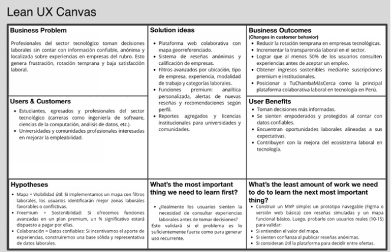

**1.3. Segmentos Objetivo**

**Primer segmento objetivo: Profesionales tecnológicos en actividad**
` `Este grupo está compuesto por egresados que trabajan actualmente o han trabajado en el sector tecnológico. Son personas que han vivido experiencias laborales diversas, desde startups hasta grandes corporaciones. **TuChambaMásCerca** les permite compartir sus experiencias, calificar empresas y orientar a nuevos profesionales, además de explorar nuevas opciones con mayor información.

**Segundo segmento objetivo: Estudiantes y egresados en búsqueda de empleo**
` `Jóvenes entre 20 y 26 años que se encuentran terminando su carrera o en su primer empleo. En esta etapa, suelen tener muchas dudas sobre el entorno laboral y poco acceso a referencias confiables. **TuChambaMásCerca** se convierte en su aliado para investigar empleos potenciales, evitar ambientes tóxicos y encontrar empleadores alineados con sus valores y expectativas.

**Capítulo II: Requirements Elicitation & Analysis**

**2.1. Competidores**

**Nombre:** Indeed

**Tipo:** Competidor directo

**Descripción:**

Portal de empleo que además permite publicar reseñas y calificaciones sobre empresas, junto con la publicación de ofertas laborales.

**Relación con el proyecto:**

Incluye reseñas laborales pero como complemento, no como función principal. No posee enfoque anónimo, comunitario ni herramientas de análisis geográfico, lo que limita su utilidad como herramienta de transparencia laboral local.

**Nombre:** LinkedIn

**Tipo:** Competidor indirecto

**Descripción:**

Red social profesional orientada al networking, visibilidad de perfiles y búsqueda de empleo. Es ampliamente usada en el sector tecnológico para posicionamiento personal y empresarial.

**Relación con el proyecto:**

LinkedIn permite conocer la presencia de una empresa, pero no sus condiciones internas. No ofrece espacio para reseñas anónimas ni evalúa ambientes laborales. La cultura profesional de la plataforma inhibe opiniones críticas.

**Nombre:** Get on Board

**Tipo:** Competidor indirecto

**Descripción:**

Plataforma de empleos especializada en tecnología, con énfasis en ofertas de trabajo remoto o híbrido dentro de LATAM.

**Relación con el proyecto:**

Aunque se enfoca en el mismo sector, Get on Board se orienta exclusivamente a la publicación de vacantes. No incluye reseñas, opiniones ni funciones de análisis sobre el ambiente laboral interno de las empresas.

**2.1.1. Análisis competitivo**

|**Categoría**|**TuChambaMásCerca (Nuestra Startup)**|**Indeed (Competidor)**|**Get on Board (Competidor)**|**LinkedIn (Competidor)**|
| :-: | :-: | :-: | :-: | :-: |
|**Perfil Overview**|Plataforma colaborativa con mapa geolocalizado de reseñas laborales anónimas del sector tecnológico peruano.|Bolsa de empleo global con reseñas laborales no anónimas.|Plataforma de empleo enfocada en tecnología y startups en LATAM.|Red social profesional con opción de postular, compartir experiencias y hacer networking.|
|**Ventaja competitiva**|Transparencia local y geolocalización visual de condiciones laborales.|Alta visibilidad de ofertas, alcance global.|Enfoque exclusivo en perfiles tech y cultura de trabajo remoto.|Networking profesional consolidado, branding personal y conexión con reclutadores.|
|**Mercado objetivo**|Estudiantes, egresados y profesionales tecnológicos peruanos.|Todo tipo de postulantes, cualquier sector.|Talento tecnológico en LATAM, principalmente desarrolladores y diseñadores.|Profesionales de todo rubro, en todo el mundo.|
|**Estrategias de marketing**|Alianzas con universidades, ferias laborales tech, redes estudiantiles y bootcamps.|SEO, Google Ads, marketing en portales laborales y redes sociales.|Enfoque digital: redes sociales, comunidad tech, partnerships con startups.|Posicionamiento orgánico, contenido profesional, cursos y herramientas de marca personal.|
|**Productos & Servicios**|Reseñas laborales anónimas, mapa interactivo, filtros por tipo de empresa, alertas personalizadas.|Publicación de empleos, reviews, y test de evaluación de candidatos.|Matching inteligente, publicaciones laborales, evaluaciones técnicas.|Publicación de empleos, conexión con talento, cursos, eventos, posts.|
|**Precios & Costos**|Freemium (reseñas y mapa gratis); versión premium con analítica y alertas; licencias institucionales.|Modelo freemium; empresas pagan por publicar y destacar vacantes.|Publicación pagada por empresas; gratuito para postulantes.|Premium para usuarios (LinkedIn Premium) y planes para empresas.|
|**Canales de distribución**|Plataforma web responsive, app móvil en desarrollo.|Web, app móvil y mailing.|Web responsive, mailing, redes sociales.|Web, app móvil, extensiones y notificaciones in-app.|

**2.1.2. Estrategias y tácticas frente a competidores**
### **Estrategia 1:** Diferenciación local con foco en transparencia laboral
**Objetivo:** Posicionarse como la plataforma más confiable y localizada para conocer el ambiente laboral real en el sector tech en Perú.

**Tácticas:**

- Reforzar el uso del mapa interactivo geolocalizado como diferenciador principal.
- Promover historias reales y anónimas de trabajadores peruanos en redes sociales y blogs.
- Asociarse con influencers tech peruanos para visibilizar malas prácticas laborales y promover la transparencia.
- Utilizar insights del mapa para crear informes gratuitos de tendencias laborales por ciudad o rubro.
### **Estrategia 2:** Conquista del segmento joven tech
**Objetivo:** Ser la herramienta de referencia para estudiantes y egresados tech al momento de elegir prácticas o primer empleo.

**Tácticas:**

- Alianzas con universidades, bootcamps y comunidades estudiantiles para brindar acceso gratuito o licencias institucionales.
- Campañas en TikTok, Instagram y Discord con mensajes directos como: *“¿Ya revisaste el mapa antes de aceptar la oferta?”*

- Integración con plataformas de reclutamiento universitario o ferias laborales.
- Generar contenido educativo tipo “top 5 alertas rojas en entrevistas” basado en experiencias reales compartidas en la plataforma.
### **Estrategia 3:** Enfocarse en la voz del trabajador, no del reclutador
**Objetivo:** Aprovechar el vacío que dejan competidores como LinkedIn e Indeed, que favorecen a empleadores más que a trabajadores.

**Tácticas:**

- Garantizar el anonimato y seguridad en las reseñas laborales.
- Promover campañas de comunidad tipo *“Yo también pasé por eso”* para fomentar la participación activa.
- Ofrecer una insignia de “empresa verificada por la comunidad” basada en comentarios positivos consistentes.
- Crear un sistema de puntos o badges por participación para usuarios activos que reseñan o votan alertas.
### **Estrategia 4:** Modelo Freemium altamente accesible
**Objetivo:** Ofrecer más valor desde la versión gratuita que los competidores ofrecen en sus versiones pagadas.

**Tácticas:**

- Brindar acceso libre a todas las reseñas y mapa general, sin necesidad de registro.
- Reservar solo funcionalidades avanzadas (como alertas personalizadas o análisis comparativo) para la versión premium.
- Ofrecer la versión institucional a bajo costo para universidades, como herramienta de empleabilidad y monitoreo.
### **Estrategia 5:** Inteligencia colectiva y datos accionables
**Objetivo:** Ser una fuente clave de información sobre el clima laboral tech en Perú.

**Tácticas:**

- Publicar informes periódicos (“Mapa de empresas tóxicas del mes”, “Top 10 empresas mejor valoradas en trabajo remoto”).
- Permitir a medios especializados o investigadores usar datos agregados (con crédito a la plataforma).
- Implementar visualizaciones compartibles para redes sociales desde cada empresa del mapa.

**2.2. Entrevistas** 

**2.2.1. Diseño de Entrevistas**

**Segmento 1: Profesionales Tecnológicos en actividad**

- ¿Actualmente trabajas en una empresa del sector tecnológico? ¿En qué rol?
- ¿Qué tan fácil te resulta conocer el ambiente laboral real de una empresa antes de entrar a trabajar en ella?
- ¿Te gustaría compartir tu experiencia laboral para orientar a otros profesionales del sector? ¿Por qué?
- ¿Alguna vez has recomendado (o desaconsejado) una empresa a colegas o conocidos? ¿Por qué?
- ¿Conoces alguna plataforma donde se puedan dejar opiniones reales sobre empresas tecnológicas en Perú? ¿Has usado alguna?
- ¿Te sentirías cómodo compartiendo una reseña sobre tu experiencia laboral si fuera de manera anónima? ¿Por qué sí o no?
- ¿Qué tan útil te parecería un mapa donde se muestran zonas con empresas bien o mal calificadas por sus empleados?
- ¿Qué criterios usarías para calificar a una empresa donde trabajaste? (Ej: cultura, liderazgo, beneficios, equilibrio vida-trabajo)
- ¿Te gustaría recibir notificaciones si alguien califica una empresa en la que has trabajado o que estás considerando?
- ¿Estarías dispuesto(a) a pagar por una versión premium con estadísticas del sector, tendencias de empleabilidad o alertas personalizadas? ¿Por qué?
- ¿Qué esperas de una plataforma que busque mejorar la transparencia y el bienestar laboral en el sector tecnológico?
- ¿Te parecería útil que las universidades o gremios profesionales tengan alianzas con esta plataforma para impulsar buenas prácticas laborales?

**Segmento 2: Estudiantes y egresados en búsqueda de empleo**

- ¿Estás actualmente buscando prácticas o empleo en el rubro tecnológico?
- ¿Qué tan fácil te resulta encontrar información confiable sobre el ambiente laboral en las empresas donde postulas o trabajas?
- ¿Te gustaría conocer la experiencia de otros practicantes o trabajadores antes de postular a una empresa? ¿Por qué?
- ¿Alguna vez has tomado una decisión laboral basada solo en lo que viste en una página web o en una oferta de LinkedIn?
- ¿Conoces alguna plataforma donde puedas leer opiniones o calificaciones reales sobre empresas tecnológicas en Perú? ¿Cuál?
- ¿Te sentirías cómodo compartiendo una reseña sobre tu experiencia laboral si fuera de manera anónima? ¿Por qué sí o no?
- ¿Qué tan útil te parecería un mapa donde puedas ver zonas laborales con buenas o malas recomendaciones de empresas?
- ¿Qué filtros te gustaría usar al buscar opiniones laborales?
- ¿Te gustaría recibir alertas si alguien comenta o califica una empresa que te interesa?
- ¿Estarías dispuesto(a) a pagar por una versión premium con análisis laboral personalizado o alertas laborales? ¿Por qué?
- ¿Qué esperas de una plataforma que te ayude a tomar mejores decisiones laborales en tu etapa profesional actual?
- ¿Te gustaría que tu universidad te ofreciera acceso a una plataforma como esta para mejorar tu empleabilidad o para tener referencias confiables?

**2.2.1. Registro de Entrevistas**

**Segmento 1: Profesionales Tecnológicos en actividad**

**Entrevista 1:**

|Nombre|Alberto Magallanes|
| :- | :- |
|Edad|23 años|
|Distrito|Surco|
|Carrera universitaria|Ingenieria de Software|

Duración total del video: 4 minutos 13 segundos

Inicio de preguntas: 00:25

Fin de preguntas: 4:11

Link:[open entrevista 1.mkv](https://upcedupe-my.sharepoint.com/:v:/g/personal/u202216035_upc_edu_pe/EY1T11bcdKNNuQ71w6FyeREBOaRqhuq_Z0W2EZdbA-7ezA?nav=eyJyZWZlcnJhbEluZm8iOnsicmVmZXJyYWxBcHAiOiJTdHJlYW1XZWJBcHAiLCJyZWZlcnJhbFZpZXciOiJTaGFyZURpYWxvZy1MaW5rIiwicmVmZXJyYWxBcHBQbGF0Zm9ybSI6IldlYiIsInJlZmVycmFsTW9kZSI6InZpZXcifX0%3D&e=hfFTJu)

**Entrevista 2:**

|Nombre|Gaben Malbec|
| :- | :- |
|Edad|23 años|
|Distrito|San Isidro|
|Carrera universitaria|Ingenieria de Software|

Duración total del video: 4 minutos 59 segundos

Inicio de preguntas: 00:28

Fin de preguntas: 4:56

Link:[open entrevista 2.mkv](https://upcedupe-my.sharepoint.com/:v:/g/personal/u202216035_upc_edu_pe/EUyRA2RAIk9JskLXJqac-TcBztwA-YZFG_2eCFu5FWXFrg?nav=eyJyZWZlcnJhbEluZm8iOnsicmVmZXJyYWxBcHAiOiJTdHJlYW1XZWJBcHAiLCJyZWZlcnJhbFZpZXciOiJTaGFyZURpYWxvZy1MaW5rIiwicmVmZXJyYWxBcHBQbGF0Zm9ybSI6IldlYiIsInJlZmVycmFsTW9kZSI6InZpZXcifX0%3D&e=1xXCGe)

**Segmento 2: Estudiantes y egresados en búsqueda de empleo**

**Entrevista 1:**

|Nombre|Omar Rivera|
| :- | :- |
|Edad|18 años|
|Distrito|La Victoria|
|Carrera universitaria|Ingenieria de Software|
|Ciclo actual|7 ciclo|
|Experiencia laboral |Sin experiencia aún|
|Situación actual respecto al trabajo|Buscando prácticas|

Duración total del video: 4 minutos 56 segundos

Inicio de preguntas: 00:34

Fin de preguntas: 4:50

Link: <https://upcedupe-my.sharepoint.com/:v:/g/personal/u202223984_upc_edu_pe/EWxJUB0uxHlHubwAJNZ__skB6B_c-iBb_a7pW0CJscDmvA?e=0NZmV3>

**Entrevista 2:**

|Nombre|Jocelyn Almerco|
| :- | :- |
|Edad|20 años|
|Distrito|San Miguel|
|Carrera universitaria|Ingenieria de Software|
|Ciclo actual|6 ciclo|
|Experiencia laboral |Sin experiencia aún|
|Situación actual respecto al trabajo|Buscando prácticas|

Duración total del video: 4 minutos 56 segundos

Inicio de preguntas: 00:34

Fin de preguntas: 4:23

Link: <https://upcedupe-my.sharepoint.com/:v:/g/personal/u202223984_upc_edu_pe/ES8upMzOjQ9Bm9BMJlXY8G4B4iE68n5TIkxM9jsgs6Lj5w?e=yCg1hu> 

**Entrevista 3:**

Duración total del video: 5 minutos 27 segundos

Inicio de preguntas: 00:47

Fin de preguntas: 5:23

Link: <https://upcedupe-my.sharepoint.com/:v:/g/personal/u202223984_upc_edu_pe/Eaz5hcTvDjdOt-pU9TomdPcBo8o8AFLJ06xxWS0d609ZRg?e=MxxWH3> 

|Nombre|Cameron Bustamante|
| :- | :- |
|Edad|20 años|
|Distrito|Surco|
|Carrera universitaria|Ingenieria de Software|
|Ciclo actual|7 ciclo|
|Experiencia laboral |Sin experiencia aún|
|Situación actual respecto al trabajo|Buscando prácticas|

**2.2.1. Análisis de Entrevistas**

**Segmento 1: Profesionales Tecnológicos en actividad**

**Entrevista 1 - Alberto Magallanes**

Alberto Magallanes es desarrollador web con experiencia en front-end y back-end. Considera difícil conocer el ambiente laboral real de una empresa antes de ingresar, por lo que valora mucho poder compartir experiencias, sean buenas o malas, especialmente si el proceso es anónimo. Aunque conoce Glassdoor, siente que no está bien integrado en el Perú. Para calificar una empresa, tendría en cuenta los beneficios, la cultura laboral y las oportunidades de crecimiento. Le gustaría recibir notificaciones cuando se califique una empresa de su interés y estaría dispuesto a pagar por una membresía si la información es de calidad.

**Entrevista 2 - Gaben Malbec**

Gaben Malbec trabaja como developer junior en una empresa dedicada a ofrecer soluciones técnicas y desarrollar aplicaciones móviles. Señala que, si bien siempre se tienen expectativas al ingresar a un nuevo empleo, es difícil conocer el ambiente laboral real de antemano. Para él, contar con esa información desde el inicio es clave para adaptarse y desempeñarse mejor en su trabajo. Ha recomendado su actual lugar de trabajo a otros, y aunque no ha utilizado plataformas como Glassdoor, sí recurre a LinkedIn. Considera que recopilar experiencias laborales de forma anónima permite obtener información más sincera y útil para quienes buscan tomar decisiones informadas.

**Segmento 2: Estudiantes y egresados en búsqueda de empleo**

**Entrevista 1 - Omar Rivera**

Nuestro primer entrevistado es un estudiante universitario que actualmente se encuentra en la búsqueda activa de prácticas preprofesionales en el área tecnológica. Su principal motivación es ganar experiencia real y aplicar lo aprendido en la universidad. Durante la entrevista, manifestó gran interés por conocer cómo es el trato real hacia los practicantes dentro de las empresas, si existe un acompañamiento adecuado y si hay posibilidades de crecimiento. Asimismo, compartió una experiencia negativa previa en la que fue atraído por una oferta que parecía muy buena en papel, pero en la práctica no cumplió con sus expectativas: no hubo un ambiente favorable, ni apoyo ni oportunidades reales de aprendizaje. A raíz de esto, trata de investigar más antes de postular, aunque considera que no siempre hay suficiente información disponible o confiable. Además, mencionó que se sentiría completamente cómodo compartiendo su experiencia si el proceso fuera anónimo, ya que eso le permitiría expresarse con sinceridad sin temor a quedar mal con alguna empresa.

**Entrevista 2 - Jocelyn Almerco**

Nuestra segunda entrevistada busca prácticas profesionales en el sector tecnológico para aplicar lo aprendido en la universidad y ganar experiencia laboral. Menciona que es difícil encontrar información confiable sobre las empresas, especialmente por los requisitos de idioma y las pocas oportunidades disponibles. Considera importante conocer experiencias de otros para tomar mejores decisiones. También le gusta la idea de un mapa interactivo que identifique zonas con buenas o malas prácticas laborales, y sugiere filtros útiles como carrera, tipo de puesto, salario, beneficios y ambiente laboral. Además, le agradaría recibir alertas sobre nuevas opiniones y estaría dispuesta a pagar por una versión premium si el análisis ofrecido fuera realmente útil.

**Entrevista 3 - Cameron Bustamante**

La tercera entrevistada está en búsqueda activa de prácticas o empleo en el rubro tecnológico, aplicando principalmente a través de plataformas como LinkedIn. Aunque considera que es relativamente fácil encontrar oportunidades, identifica que el proceso puede volverse complicado por la falta de seguimiento o comunicación por parte de las empresas.Valora mucho la idea de conocer experiencias previas de practicantes, ya que esto le permitiría tomar decisiones más informadas. Menciona que no ha encontrado una plataforma que brinde opiniones reales y completas sobre empresas, y considera que una herramienta así sería muy útil. Está de acuerdo con que las experiencias compartidas sean anónimas, siempre que se mantenga el respeto y la veracidad de la información. También muestra interés en un mapa interactivo que muestre zonas laborales con buenas o malas prácticas, considerándolo una herramienta práctica para orientar la búsqueda laboral.

**2.3. Needfinding**

**2.3.1. User Personas**

Como resultado del análisis de entrevistas realizadas a potenciales usuarios y del estudio de plataformas similares en el mercado, se han identificado dos segmentos objetivos clave para la propuesta de valor de la startup **TuChambaMásCerca**.

**Segmento 1: Profesionales Tecnológicos en actividad**

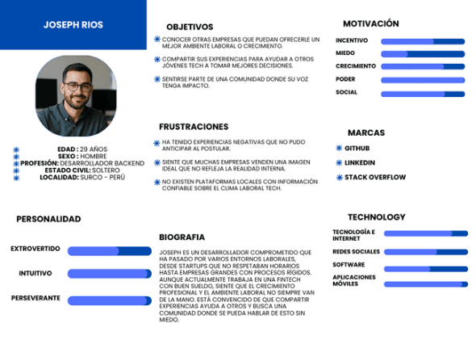

**Segmento 2: Estudiantes y egresados en búsqueda de empleo**

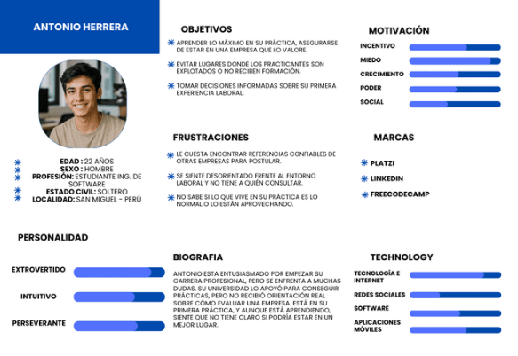

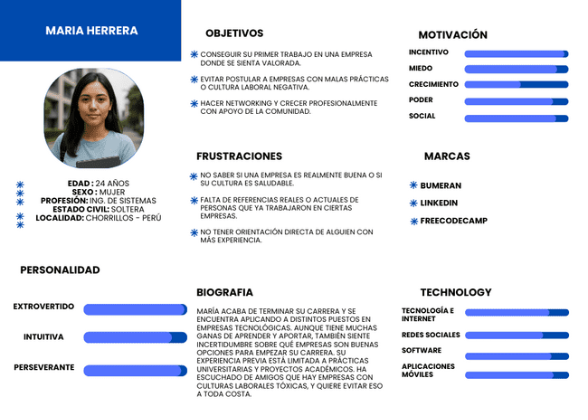

**2.3.2. User Task Matrix**

**Segmento 1: Profesionales Tecnológicos en actividad**

|**Tarea del usuario**|**Importancia**|**Frecuencia**|
| :- | :- | :- |
|**Compartir una experiencia laboral pasada**|**Alta**|**Media**|
|**Calificar anónimamente a una empresa donde trabajó**|**Alta**|**Baja**|
|**Investigar la reputación de una empresa antes de cambiar de empleo**|**Alta**|**Media**|
|**Consultar si una empresa tiene cultura tóxica o problemas laborales**|**Alta**|**Media**|
|**Explorar nuevas opciones laborales con mejor cultura organizacional**|**Alta**|**Media**|
|**Advertir a otros profesionales sobre una mala experiencia**|**Media**|**Baja**|
|**Recibir alertas de actividad sobre empresas de interés**|**Media**|**Baja**|
|**Comparar empresas según beneficios, liderazgo y cultura**|**Media**|**Baja**|
|**Leer experiencias de colegas del sector**|**Media**|**Media**|
|**Contribuir activamente con reseñas para mejorar el ecosistema laboral**|**Media**|**Baja**|

**Segmento 2: Estudiantes y egresados en búsqueda de empleo**

|**Tarea del usuario**|**Importancia**|**Frecuencia**|
| :-: | :-: | :-: |
|**Investigar empresas antes de postular**|**Alta**|**Alta**|
|**Leer experiencias reales de practicantes o empleados**|**Alta**|**Alta**|
|**Evitar postular a empresas con mala reputación**|**Alta**|**Media**|
|**Consultar opiniones sobre el ambiente laboral antes de una entrevista o postulación**|**Alta**|**Media**|
|**Comparar cultura y beneficios entre empresas**|**Alta**|**Media**|
|**Recibir recomendaciones personalizadas o alertas laborales**|**Media**|**Baja**|
|**Compartir una experiencia laboral (si ya tuvo una)**|**Media**|**Baja**|
|**Usar filtros para encontrar experiencias laborales similares a su perfil**|**Media**|**Baja**|
|**Pedir referencias informales a conocidos**|**Media**|**Media**|
|**Buscar plataformas confiables para tomar decisiones laborales**|**Alta**|**Alta**|

**2.3.3. User Journey Mapping**

**Segmento 1: Profesionales Tecnológicos en actividad**

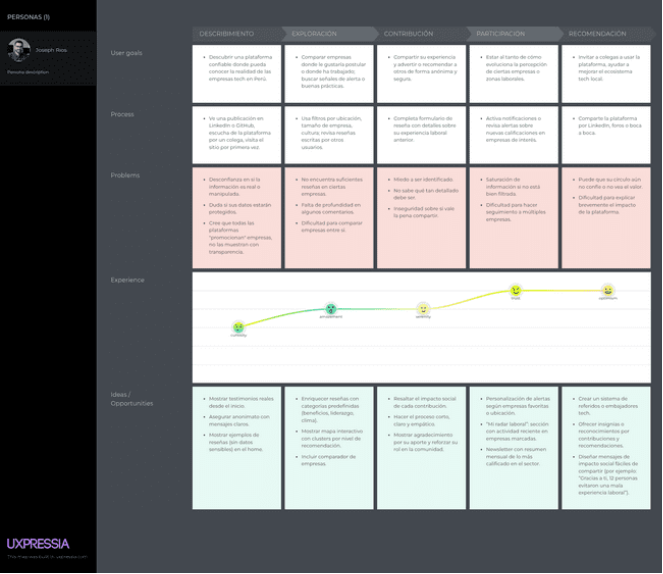

**Segmento 2: Estudiantes y egresados en búsqueda de empleo**

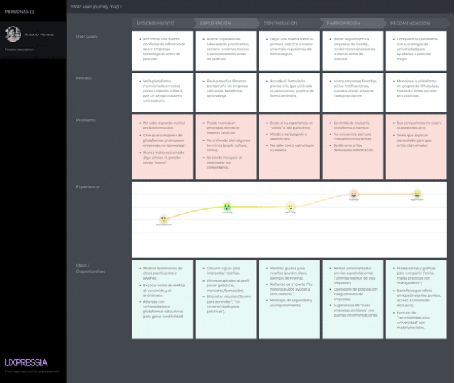

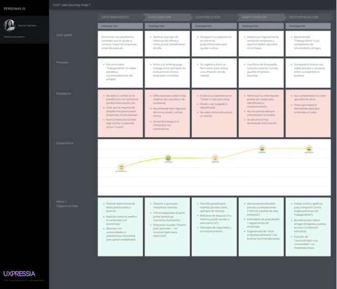

**2.3.4. Empathy Mapping**

En esta sección se presenta el Empathy Mapping, una herramienta que facilita la creación de un perfil detallado de los User Personas y permite desarrollar una comprensión profunda de su perspectiva y experiencia. Los diagramas de empatía proporcionan una visión completa de cómo los usuarios piensan, sienten, dicen y hacen, ayudando a captar mejor sus emociones, preocupaciones y necesidades.

**Segmento 1: Profesionales Tecnológicos en actividad**

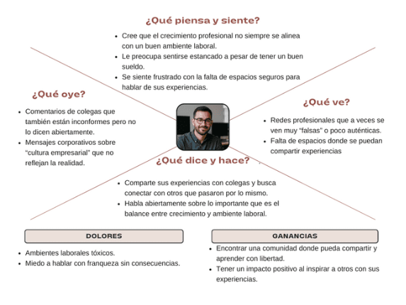

**Segmento 2: Estudiantes y egresados en búsqueda de empleo**

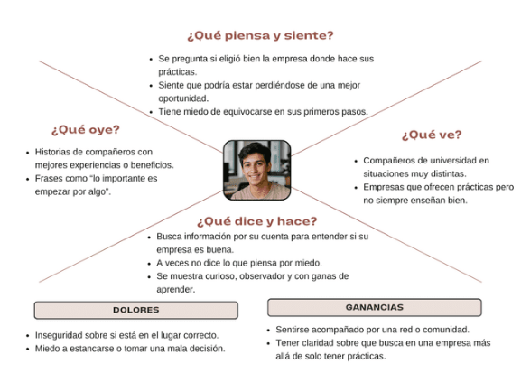

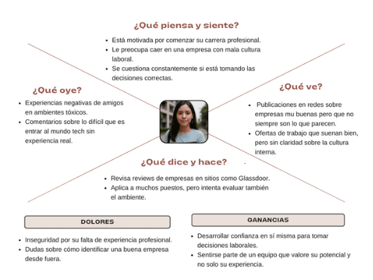

**2.3.5. As-is Scenario Mapping** 

En esta sección se presentan los As-Is Scenario Mapping para ambos segmentos objetivos. Estos mapas detallan los escenarios actuales en los que los usuarios interactúan con el software, identificando y comprendiendo los puntos de contacto y las experiencias a lo largo del proceso.

**Segmento 1: Profesionales Tecnológicos en actividad**

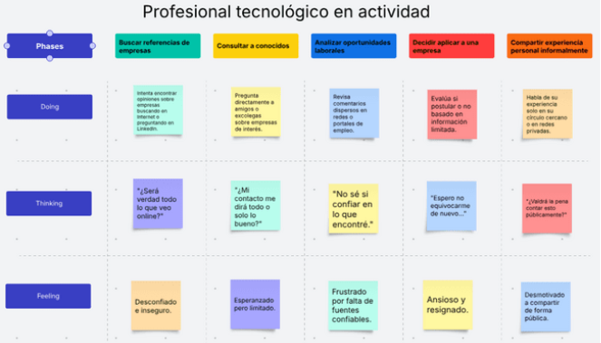

**Segmento 2: Estudiantes y egresados en búsqueda de empleo**

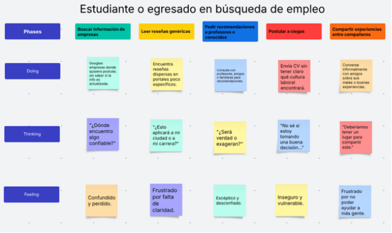

**2.4. Ubiquitous Language** 

|**Termino (Inglés)** |**Término (Español)**|**Definición**|
| :- | :- | :- |
|**Job Recommendation**|**Recomendación de trabajo**|**Evaluación voluntaria que un usuario realiza sobre una experiencia laboral vivida en una empresa del rubro tecnológico. Incluye información como sueldo, ambiente laboral, tecnologías utilizadas, entre otros.**|
|**Tech Professional**|**Profesional tecnológico**|**Persona con formación o experiencia laboral en el sector tecnológico, incluyendo desarrolladores, ingenieros de software, diseñadores UX/UI, entre otros.**|
|**Job Seeker**|||

||
| :- |

||||
| :- | :- | :- |

|**Buscador de empleo**|
| :- |

|||**Usuario que está en búsqueda de su primer trabajo o en proceso de transición laboral, mayormente estudiantes o egresados.**|
| :- | :- | :- |
|**Rating System**|**Sistema de calificación**|**Herramienta mediante la cual los usuarios otorgan estrellas o comentarios a diversos aspectos del trabajo, como entrevistas, beneficios, oportunidades de crecimiento, etc.**|
|**Emotional Support Chatbot**|**Chatbot de apoyo emocional**|**Asistente virtual integrado en la plataforma que brinda apoyo, consejos y recursos en situaciones de ansiedad, frustración o desánimo laboral.**|
|**Job Filters**|**Filtros de empleo**|**Herramientas en la plataforma que permiten buscar recomendaciones de trabajos según criterios como carrera, sueldo, tecnologías, ubicación, etc.**|
|**Job Ranking**|**Ranking de trabajos**|**Lista que muestra los trabajos más y menos recomendados por la comunidad, basada en las calificaciones.**|
|**User Profile**|**Perfil de usuario**|**Sección personalizada con información de contacto del usuario y un historial de recomendaciones enviadas o recibidas.**|
|**Professional Growth**|**Crecimiento profesional**|**Potencial de desarrollo que ofrece un trabajo en términos de habilidades, promociones o adquisición de nuevas tecnologías.**|
|**Contact Button**|**Botón de contacto**|**Funcionalidad que permite al usuario interesado contactar directamente a otro usuario para obtener más detalles de una recomendación.**|
|**Inclusive Platform**|**Plataforma inclusiva**|**Plataforma diseñada para ser accesible, usable y comprensible por personas con diversas habilidades, idiomas y condiciones.**|
|**Map Integration**|**Integración de mapa actualizado** |**Funcionalidad que permite mostrar trabajadores mejores y peores recomendados según ubicación geográfica mediante APIs externas como Google Maps.** |
|**Collaborative Community**|**Comunidad colaborativa**|**Red de usuarios que aportan y comparten experiencias laborales para ayudar a otros a tomar decisiones informadas.**|
|**Top-Rated Jobs**|||

||
| :- |

||||
| :- | :- | :- |

|**Trabajos mejor calificados**|
| :- |

|||**Empleos que han recibido evaluaciones positivas por parte de la comunidad, según múltiples dimensiones.**|
| :- | :- | :- |
|**Trusted Reference**|**Referencia confiable**|**Opinión de un usuario basada en su experiencia real que sirve de guía a otros para evitar ambientes laborales desfavorables.**|

**Capitulo  III: Requirements Specification**

**3.1. To-Be Scenario Mapping**

Luego de realizar el ai-is con sus fases propuestas, para el to-be se realizaron nuevos procesos enfocados en mejorar las fases de los segmentos objetivos con nuestro proyecto.

**Segmento Objetivo 1: JOSEPH RIOS  - Profesional tecnológico en actividad**

|**Phases** |**Doing** |**Thinking** |**Feeling** |
| :- | :- | :- | :- |
|Descubrir la plataforma|Explora "TuChambaMásCerca" desde redes sociales o recomendación de colegas.|"¿Esta plataforma tendrá información confiable y real sobre las empresas?"|Intrigado, esperanzado.|
|Consultar experiencias laborales|Filtrar empresas por ubicación, tecnologías y ranking.|||

||
| :- |

|||||
| :- | :- | :- | :- |

|"Quiero ver si otros han tenido buenas o malas experiencias en mi sector."|
| :- |

||||Curioso, analítico.|
| :- | :- | :- | :- |
|Calificar empleos anteriores|Ingresa su experiencia en la plataforma evaluando sueldos, cultura, beneficios y crecimiento.|"Compartiré esto para que otros no caigan en una empresa tóxica o aprovechen una buena oportunidad."|Empoderado, útil.|
|Contactar a otros profesionales|Envía mensajes a otros usuarios que recomendaron empresas interesantes.|"Quiero saber si este empleo es realmente bueno antes de aplicar."|Conectado, respaldado.|
|Explorar nuevas oportunidades|Visualiza empleos recomendados y ajusta filtros por intereses.|"¿Podré encontrar un mejor lugar para crecer profesionalmente?"|Motivado, optimista.|
|Recibir apoyo emocional|Interactúa con el chatbot en momentos de frustración o indecisión.|"A veces sólo necesito orientación o alguien que me escuche mientras busco trabajo o cambio de empresa."|Acompañado, comprendido.|

**Segmento Objetivo 2:** 

**ANTONIO HERRERA  - Estudiante en búsqueda de empleo** 

|**Phases** |**Doing** |**Thinking** |**Feeling** |
| :- | :- | :- | :- |
|Descubrir la plataforma|Llega por recomendación universitaria o anuncios en redes.|"Quizás esta plataforma me ayude a no cometer errores de principiante al elegir mi primer trabajo."|Entusiasmado, curioso.|
|Informarse sobre empleadores|Lee evaluaciones sobre empresas del rubro tecnológico en Perú.|"No quiero entrar en una empresa que no valore a los recién practicantes."|Precavido, determinado.|
|Consultar experiencias|Busca empresas que contraten jóvenes sin experiencia.|"¿Habrá empresas que realmente aprecien a estudiantes?"|Motivado, expectante.|
|Aplicar a empleos recomendados|Elige las mejores opciones basadas en el ranking y comentarios de otros profesionales.|"Quiero empezar mi carrera en un lugar con cultura de aprendizaje."|Esperanzado, decidido.|
|Contactar a profesionales|Hace preguntas a quienes ya han trabajado en la empresa que le interesa.|"Así evitaré sorpresas o desilusiones antes de aplicar."|Confiado, respaldado.|
|Gestionar ansiedad laboral|Utiliza el chatbot cuando se siente frustrado por rechazos o silencios en procesos de selección.|"Me siento solo en esto, pero al menos la plataforma me entiende y apoya."|Acompañado, menos ansioso.|

**MARIA HERRERA  - Estudiante egresada en búsqueda de empleo**

|**Phases** |**Doing** |**Thinking** |**Feeling** |
| :- | :- | :- | :- |
|Descubrir la plataforma|Accede a "TuChambaMásCerca" tras terminar su carrera o en redes.|"Estoy buscando mi primer empleo serio, necesito información fiable."|Motivado, inseguro.|
|Conocer el mercado laboral|Explora las empresas más recomendadas y ajusta filtros por sueldo, tecnologías o beneficios.|"Quiero asegurarme de elegir un lugar donde pueda crecer profesionalmente."|Cauteloso, expectante.|
|Leer evaluaciones de empresas|Analiza calificaciones de cultura laboral, procesos de entrevista, beneficios y sueldos.|"Evitaré malas experiencias gracias a las vivencias de otros."|Seguro, agradecido.|
|Aplicar con decisión|Selecciona las mejores empresas y aplica con confianza.|"Este feedback me da seguridad para postular a dicha empresa"|Determinado, confiado.|
|Contactar usuarios recomendantes|Se comunica para obtener opiniones reales antes de firmar un contrato.|"Me gustaría saber más detalles antes de dar el siguiente paso."|Seguro, respaldado.|
|Recibir apoyo emocional|Acude al chatbot si el proceso se vuelve frustrante o las expectativas no se cumplen.|"Aunque me frustre, no estoy solo en este proceso."|Aliviado, acompañado.|

**3.2. User Stories**

Las User Stories nos servirán para descubrir de manera más exacta y detallada las diferentes funciones de la aplicación, adaptándolas a las necesidades y prioridades que tendrán y tienen los usuarios. Estas historias también capturaran el propósito de uso de las personas. Brindando así una comprensión más completa de cómo se va a relacionar con la aplicación y que esperan lograr en ella. 

**EPIC STORIES** 

|**Epic/Story ID** |**Titulo**|**Descripción** |
| :- | :- | :- |
|EPIC-01|Registro y Gestión de Recomendaciones|Como usuario de la plataforma, deseo registrar las experiencias laborales que he vivido en diferentes empresas tecnológicas, incluyendo detalles como salario, herramientas utilizadas, procesos de entrevistas y ambiente laboral, con el fin de ayudar a otros usuarios a tomar decisiones laborales más informadas y acertadas. Además, deseo poder actualizar o eliminar estas recomendaciones en caso cambien las condiciones o quiera aportar información adicional.|
|EPIC-02|Calificación de Empresas|Como usuario, deseo evaluar y calificar a las empresas en las que he trabajado usando un sistema de puntuación y comentarios, para que la comunidad tenga una referencia clara y transparente sobre aspectos como el ambiente de trabajo, beneficios, respeto a la diversidad, estabilidad laboral y cultura organizacional. Esto permitirá que otros usuarios puedan tomar decisiones basadas en información real y no solo en la oferta que publica la empresa.|
|EPIC-03|Visualización y Filtro de Recomendaciones|Como usuario, deseo poder buscar trabajos recomendados por la comunidad usando filtros que me permitan acotar los resultados según criterios como ubicación geográfica, salario, tecnologías utilizadas, cultura laboral, oportunidades de crecimiento y beneficios adicionales, con el fin de encontrar opciones que se ajusten a mis necesidades personales y profesionales.|
|EPIC-04|||

||
| :- |

||||
| :- | :- | :- |

|Contacto entre Usuarios|
| :- |

|||Como usuario, deseo tener la posibilidad de contactar a los profesionales que han dejado recomendaciones sobre una empresa, para poder aclarar dudas específicas, solicitar consejos y obtener información adicional que me ayude a tomar una mejor decisión antes de aplicar o aceptar un trabajo. Esta funcionalidad me permitirá contar con testimonios de primera mano, generando confianza y reduciendo riesgos en mi elección.|
| :- | :- | :- |
|EPIC-05|Chatbot de Apoyo Emocional|Como usuario, deseo acceder a un chatbot integrado en la plataforma que me brinde orientación y apoyo emocional en situaciones de frustración, ansiedad o incertidumbre durante mi búsqueda laboral, recomendando recursos profesionales, frases motivadoras o pautas prácticas para manejar emociones en el proceso de postulación o adaptación a un nuevo empleo.|
|EPIC-06|Gestión de Perfil de Usuario|Como usuario, deseo tener un perfil personalizado donde pueda actualizar mi información de contacto, no información personal porque es anónimo. como por ejemplo el correo electrónico y detalles de contacto, además de administrar las recomendaciones que he realizado, para facilitar la interacción con otros usuarios y mantener mi información organizada y actualizada dentro de la comunidad.|
|EPIC-07|Ranking de Mejores y Peores Empresas|Como usuario, deseo tener acceso a un ranking que muestre las empresas mejor y peor valoradas por la comunidad, en función de los criterios más relevantes como ambiente laboral, cultura, beneficios, salarios y oportunidades de desarrollo, para identificar rápidamente cuáles empresas son confiables y cuáles debo evitar, optimizando así mi proceso de búsqueda de empleo.|
|EPIC-08|Integración de APIs Externas|Como desarrollador de la plataforma, deseo integrar servicios de APIs externas como mapas y envío de correos electrónicos automáticos, para que los usuarios puedan encontrar trabajos cercanos a su ubicación, visualizar información de contacto en tiempo real y enviar mensajes de forma eficiente y segura sin necesidad de salir de la plataforma.|
|EPIC-09|Interacción y Accesibilidad|Como usuario, deseo que la plataforma sea visualmente accesible y fácil de usar, con soporte multilingüe y adaptada para personas con diferentes habilidades, para que cualquier usuario pueda interactuar de manera inclusiva y sin barreras.|
|EPIC-10|Infraestructura, Seguridad y Privacidad|Como usuario y administrador de mi información, deseo que la plataforma garantice la seguridad, privacidad y disponibilidad de mis  datos mediante infraestructura robusta y estándares de protección, para que pueda confiar en su uso y que mis datos estén protegidos contra accesos no autorizados.|
||||

||
| :- |

||||
| :- | :- | :- |

|EPIC-11|
| :- |

||||
| :- | :- | :- |

||
| :- |

||||
| :- | :- | :- |

|Landing Page|
| :- |

|||Como visitante, deseo acceder a una landing page clara y atractiva que explique el valor y funcionamiento de la plataforma, para comprender sus beneficios y registrarse de forma sencilla y rápida.|
| :- | :- | :- |

**User Stories** 

|**TITULO** |**DESCRIPCIÓN** |**CRITERIOS DE ACEPTACIÓN** |**RELACIONADO CON (EPIC  ID)** |
| :- | :- | :- | :- |
|**HU01- Registro de recomendación**|**Como usuario, deseo registrar una recomendación laboral detallada, para compartir mi experiencia con la comunidad.**|
**Scenario 1: Registro exitoso de recomendación ` `GIVEN un usuario logueado ` `WHEN completa correctamente el formulario de recomendación ` `THEN la recomendación es registrada y publicada en la plataforma ` `AND es visible en la sección "Trabajos Recomendados".** 

**Scenario 2: Error al registrar por campos vacíos ` `GIVEN un usuario que deja campos obligatorios sin completar ` `WHEN intenta enviar la recomendación ` `THEN la plataforma muestra un mensaje de error indicando los campos vacíos ` `AND no permite guardar la recomendación hasta que todos los campos estén completos.**

|**EPIC-01**|
|**HU02- Edición de recomendación**|**Como usuario, deseo editar mis recomendaciones, para mantener la información actualizada.**|
**Scenario 3: Edición exitosa de recomendación**

**GIVEN un usuario con una recomendación publicada**

**WHEN accede a la opción "Editar" y modifica los campos**

**THEN los cambios son guardados correctamente**

**AND la recomendación actualizada es visible para otros usuarios.**
|**EPIC-01**|
|**HU03- Eliminación de recomendación**|**Como usuario, deseo eliminar recomendaciones, para retirar información desactualizada o errónea.**|
**Scenario 4: Eliminación confirmada de recomendación**

**GIVEN un usuario con una recomendación existente**

**WHEN selecciona "Eliminar" y confirma la acción**

**THEN la recomendación es eliminada de la plataforma**

**AND ya no es visible en los listados públicos.**
|**EPIC-01**|
|**HU04-Calificación de empresa**|**Como usuario, deseo calificar empresas con estrellas, para reflejar mi nivel de satisfacción.**|
**Scenario 5: Calificación exitosa de empresa**

**GIVEN un usuario que ha trabajado en una empresa**

**WHEN selecciona la cantidad de estrellas y confirma su calificación**

**THEN la evaluación se guarda correctamente**

**AND es visible en el perfil de la empresa.**
|**EPIC-02**|
|**HU05-Comentar experiencia en empresa**|**Como usuario, deseo dejar comentarios junto con mi calificación, para brindar contexto a otros profesionales.**|
**Scenario 6: Registro de comentario asociado a empresa**

**GIVEN un usuario en la sección de recomendación**

**WHEN escribe un comentario en el campo de observaciones**

**THEN el comentario se guarda junto a la calificación**

**AND es visible para todos los usuarios que consulten esa empresa.**
|**EPIC-02**|
|**HU06- Buscar trabajos recomendados**|**Como usuario, deseo buscar trabajos recomendados mediante filtros, para encontrar opciones que se ajusten a mis necesidades.**|
**Scenario 7: Búsqueda con filtros aplicada**

**GIVEN un usuario en la sección de "Ver Trabajos Recomendados"**

**WHEN selecciona filtros por carrera, ubicación o tecnologías**

**THEN los resultados se actualizan mostrando solo las recomendaciones que cumplen con los criterios**

**AND se permite modificar los filtros en cualquier momento.**
|**EPIC-03**|
|**HU07- Ordenar resultados de búsqueda**|**Como usuario, deseo ordenar los resultados según criterios como calificación o cercanía, para tomar decisiones más rápidas.**|
**Scenario 8: Ordenamiento de resultados**

**GIVEN una lista de trabajos recomendados**

**WHEN selecciona una opción de orden (por calificación, fecha o cercanía)**

**THEN los resultados se reorganizan automáticamente**

**AND se muestra el nuevo orden en pantalla.**
|**EPIC-03**|
|**HU08- Contactar autor de recomendación** |**Como usuario, deseo contactar al autor de una recomendación, para obtener detalles antes de postular.**|
**Scenario 9: Contacto exitoso entre usuarios**

**GIVEN un usuario que visualiza una recomendación**

**WHEN presiona el botón "Contactar" y envía un mensaje**

**THEN el autor de la recomendación recibe la notificación**

**AND el mensaje queda registrado en la bandeja de entrada.**
|**EPIC-04**|
|**HU09- Gestión de mensajes recibidos**|**Como usuario, deseo gestionar los mensajes que otros usuarios me envían, para responder o eliminarlos.**|
**Scenario 10: Gestión de mensajes**

**GIVEN que un usuario recibe un mensaje en la plataforma**

**WHEN accede a su bandeja de entrada**

**THEN puede visualizar el mensaje recibido**

**AND puede responderlo o eliminarlo si lo desea.**
|**EPIC-04**|
|**HU10-Interacción con Chatbot de Apoyo**|**Como usuario, deseo interactuar con un chatbot que me brinde apoyo emocional cuando sienta frustración en la búsqueda de trabajo.**|
**Scenario 11: Conversación de apoyo con el chatbot**

**GIVEN que un usuario abre la ventana del chatbot**

**WHEN ingresa un mensaje que expresa frustración o desmotivación**

**THEN el chatbot identifica el tono emocional**

**AND responde con un mensaje de apoyo o recursos recomendados.**
|**EPIC-05**|
|**HU11-Recibir frases motivadoras**|**Como usuario, deseo que el chatbot me envíe frases motivadoras durante una conversación para levantar mi ánimo.**|
**Scenario 12: Envío de frase motivadora por parte del chatbot**

**GIVEN que el usuario mantiene una conversación con el chatbot**

**WHEN el chatbot detecta sentimientos de ansiedad o preocupación**

**THEN responde con una frase motivacional positiva**

**AND sugiere posibles acciones o recursos adicionales.**
|**EPIC-05**|
|**HU12- Actualización de perfil de usuario**|**Como usuario, deseo actualizar mi información de contacto para asegurar que otros usuarios tengan acceso a mis datos actualizados.**|
**Scenario 13: Actualización exitosa de perfil**

**GIVEN que el usuario accede a su perfil personal**

**WHEN modifica sus datos y presiona guardar**

**THEN el sistema almacena los cambios correctamente**

**AND muestra un mensaje de confirmación.**
|**EPIC-06**|
|**HU13-Visualización de perfil**|**Como usuario, deseo poder visualizar mi información de contacto, para verificar que esté actualizada.**|
**Scenario 14: Visualización de datos de perfil ` `GIVEN que el usuario accede a la sección "Mi Perfil" ` `WHEN selecciona "Ver perfil" ` `THEN se muestran todos los datos registrados ` `AND se actualizan en tiempo real si son modificados.** 

|**EPIC-06**|
|**HU14-Consultar ranking de empresas mejor valoradas**|**Como usuario, deseo consultar el listado de empresas con las mejores calificaciones, para identificar oportunidades laborales confiables.**|
**Scenario 15: Visualización de empresas mejor evaluadas**

**GIVEN que accedo a la sección "Ranking de Empresas"**

**WHEN selecciono "Mejor Valoradas"**

**THEN el sistema muestra una lista ordenada de mayor a menor puntuación**

**AND permite visitar el perfil detallado de cada empresa.**
|**EPIC-07**|
|**HU15 - Consultar ranking de empresas peor valoradas**|**Como usuario, deseo revisar las empresas con peor evaluación, para evitar ambientes laborales tóxicos.**|
**Scenario 16: Visualización de empresas peor evaluadas**

**GIVEN que accedo a la sección "Ranking de Empresas"**

**WHEN selecciono "Peor Valoradas"**

**THEN el sistema muestra la lista ordenada de menor a mayor puntuación**

**AND ofrece enlaces para ver opiniones detalladas.**
|**EPIC-07**|
|**HU16-Visualización de empresas en el mapa**|**Como usuario, deseo ver empresas recomendadas cerca de mi ubicación usando mapas, para encontrar oportunidades accesibles.**|
**Scenario 17: Visualización geolocalizada de empresas**

**GIVEN que el usuario otorga permiso de acceso a su ubicación**

**WHEN abre la sección de "Empresas Cercanas"**

**THEN el sistema muestra un mapa con las empresas recomendadas**

**AND permite acceder al perfil de cada empresa desde el mapa.**
|**EPIC-08**|
|**HU17-Recepción de notificaciones automáticas**|**Como usuario, deseo recibir notificaciones automáticas cuando otro usuario me envía un mensaje.**|
**Scenario 18: Envío de notificación por nuevo mensaje**

**GIVEN que un usuario recibe un mensaje privado**

**WHEN el mensaje es enviado**

**THEN el sistema envía una notificación automática al correo del receptor**

**AND almacena una copia en la bandeja de entrada interna.**
|**EPIC-08**|
|**HU18-Cambio de idioma en la plataforma**|**Como usuario, deseo cambiar el idioma de la plataforma para usarla en inglés o español, según mi preferencia.**|
**Scenario 19: Cambio exitoso de idioma**

**GIVEN que el usuario accede a la configuración de idioma**

**WHEN selecciona un idioma diferente**

**THEN toda la interfaz se actualiza con el nuevo idioma**

**AND los cambios se aplican en tiempo real.**
|**EPIC-09**|
|**HU19-Accesibilidad para usuarios con discapacidad visual**|**Como usuario con discapacidad visual, deseo que la plataforma sea compatible con lectores de pantalla para navegar sin problemas.**|
**Scenario 20: Soporte de lector de pantalla**

**GIVEN que un usuario accede a la plataforma con un lector de pantalla**

**WHEN navega por las secciones principales**

**THEN cada elemento es leído correctamente**

**AND los botones y enlaces son accesibles mediante teclado.**
|**EPIC-09**|
|**HU20-Protección de datos personales**|**Como usuario, deseo que mis datos personales estén protegidos mediante cifrado, para garantizar su seguridad.**|
**Scenario 21: Protección de datos con cifrado**

**GIVEN que un usuario envía datos personales en un formulario**

**WHEN los datos son procesados**

**THEN el sistema aplica cifrado antes de almacenarlos**

**AND garantiza que la información no es accesible para terceros.**
|**EPIC-10**|
|**HU21-Acceso seguro a la plataforma**|**Como usuario, deseo que la autenticación cuente con medidas de seguridad, para evitar accesos no autorizados.**|
**Scenario 22: Inicio de sesión seguro ` `GIVEN que un usuario accede a la pantalla de inicio de sesión ` `WHEN ingresa sus credenciales ` `THEN el sistema verifica autenticación segura mediante HTTPS ` `AND permite o deniega el acceso según la validez de las credenciales.** 

|**EPIC-10**|
|**HU22-Navegación informativa en la Landing Page**|**Como visitante, deseo recorrer la landing page para entender cómo funciona la plataforma antes de registrarme.**|
**Scenario 23: Recorrido de la landing page ` `GIVEN que un visitante accede a la landing page ` `WHEN navega haciendo scroll o selecciona menús ` `THEN puede conocer las secciones explicativas de la plataforma ` `AND encuentra el botón de registro fácilmente en la parte superior e inferior.** 

|**EPIC-11**|
|**HU23-Redirección a formulario de registro**|**Como visitante, deseo ser redirigido fácilmente desde la landing page al formulario de registro para crear mi cuenta.**|
**Scenario 24: Acceso desde landing a registro**

**GIVEN que un visitante está en la landing page**

**WHEN hace clic en "Únete Ahora"**

**THEN el sistema lo redirige al formulario de registro**

**AND carga el formulario sin errores.**
|**EPIC-11**|
|**HU24- Registro de nuevo usuario**|**Como nuevo usuario, deseo registrarme en la plataforma para crear un perfil personal y comenzar a usar todas las funcionalidades.**|
**Scenario 25: Registro exitoso de usuario**

**GIVEN un nuevo usuario que desea registrarse**

**WHEN completa el formulario de registro con sus datos válidos**

**THEN la plataforma crea su cuenta correctamente**

**AND envía un correo de confirmación con los detalles de acceso.**

**Scenario 26: Error en el registro por campos incompletos**

**GIVEN que un usuario deja campos obligatorios vacíos**

**WHEN intenta enviar el formulario de registro**

**THEN la plataforma muestra un mensaje de error indicando los campos faltantes**

**AND no permite crear la cuenta hasta completar toda la información requerida.**
|**EPIC-06**|
|**HU25-Inicio de sesión seguro**|**Como usuario registrado, deseo iniciar sesión en la plataforma de manera segura, para acceder a mi perfil y usar las funcionalidades.**|
**Scenario 27: Inicio de sesión exitoso ` `GIVEN que el usuario tiene una cuenta registrada ` `WHEN ingresa su correo y contraseña correctamente ` `THEN la plataforma valida las credenciales ` `AND redirige al usuario a la página principal.**

**Scenario 28: Fallo en el inicio de sesión por datos incorrectos**

**GIVEN que el usuario ingresa un correo o contraseña inválidos**

**WHEN intenta iniciar sesión**

**THEN la plataforma muestra un mensaje de error**

**AND no permite el acceso hasta que se ingresen las credenciales correctas.** 

|**EPIC-06**|
|**HU26-Recuperación de contraseña**|**Como usuario, deseo poder recuperar mi contraseña en caso de olvido, para poder acceder nuevamente a la plataforma.**|
**Scenario 29: Recuperación exitosa de contraseña**

**GIVEN que un usuario olvida su contraseña**

**WHEN solicita recuperación mediante la opción "Olvidé mi contraseña"**

**THEN la plataforma envía un enlace de restablecimiento al correo registrado**

**AND permite crear una nueva contraseña de acceso.**
|**EPIC-06**|

**3.3. Impact Mapping**

En esta sección, se plantearon metas de negocio utilizando los criterios SMART para elaborar el Impact Mapping en base a nuestras User Personas y User Stories.

**Segmento Objetivo 1: Joseph Rios — Profesional Tecnológico en Actividad**

|**Meta (Goal)**|**Actores (Who)**|**Impactos (How)**|**Entregables (What)**|
| :-: | :-: | :-: | :-: |
|**Ayudar a profesionales tecnológicos en actividad a tomar mejores decisiones laborales a través de recomendaciones confiables.**|
**Joseph Rios — Profesional con experiencia en empresas tecnológicas.**

|**Compartir sus propias experiencias laborales en la plataforma.**|
**US-1: Registro de recomendación.**

**US-4: Calificación de empresa.**

**US-5: Comentar experiencia en empresa.**
|
|||**Consultar las recomendaciones de otros profesionales sobre empresas antes de postular.**|
**US-6: Buscar trabajos recomendados.**

**US-7: Ordenar resultados de búsqueda.**
|
|||**Contactar a colegas que publicaron recomendaciones para aclarar dudas.**|
**US-8: Contactar autor de recomendación.**

**US-9: Gestión de mensajes recibidos.**
|
|||**Ver rankings de mejores y peores empresas para identificar empleadores recomendados o a evitar.**|
**US-14: Ranking de mejores empresas.**

**US-15: Ranking de peores empresas.**
|
|||**Actualizar sus datos de perfil para mantener su información de contacto actualizada.**|
**US-12: Actualización de perfil.**

**US-13: Visualización de perfil.**
|

**Segmento Objetivo 2:**

` `**Antonio Herrera — Estudiante en Búsqueda de Empleo**

|**Meta (Goal)**|**Actores (Who)**|**Impactos (How)**|**Entregables (What)**|
| :-: | :-: | :-: | :-: |
|**Facilitar la búsqueda de empleo a estudiantes que están por egresar, brindándoles acceso a información confiable sobre empresas y empleadores.**|
**Antonio Herrera — Estudiante sin experiencia.**

|**Consultar recomendaciones para evitar empresas con malas prácticas y encontrar empleadores confiables.**|
**US-6: Buscar trabajos recomendados.**

**US-7: Ordenar resultados de búsqueda.**

**US-14: Ranking de mejores empresas.**

**US-15: Ranking de peores empresas.**
|
|||**Contactar a usuarios que han calificado empresas para resolver dudas antes de postular.**|
**US-8: Contactar autor de recomendación.**

**US-9: Gestión de mensajes recibidos.**
|
|||**Acceder al chatbot en momentos de frustración o ansiedad durante la búsqueda de empleo.**|
**US-10: Interacción con Chatbot.**

**US-11: Frases motivadoras.**
|
|||**Crear su cuenta y actualizar su perfil para empezar a usar la plataforma.**|
**US-24: Registro de nuevo usuario.**

**US-12: Actualización de perfil.**
|

**Maria Herrera — Egresada en Búsqueda de Empleo**

|**Meta (Goal)**|**Actores (Who)**|**Impactos (How)**|**Entregables (What)**|
| :-: | :-: | :-: | :-: |
|**Brindar herramientas a egresados para encontrar trabajos adecuados, evitando ambientes laborales tóxicos y accediendo a datos de empleadores confiables.**|
**Maria Herrera — Egresada en búsqueda de empleo.**

|**Consultar rankings, calificaciones y comentarios sobre empresas para tomar decisiones informadas.**|
**US-4: Calificación de empresa.**

**US-5: Comentar experiencia.**

**US-14: Ranking de mejores empresas.**

**US-15: Ranking de peores empresas.**
|
|||**Contactar autores de recomendaciones para validar la información antes de postular.**|
**US-8: Contactar autor de recomendación.**

**US-9: Gestión de mensajes recibidos.**
|
|||**Usar filtros y ordenar resultados para buscar opciones acordes a sus preferencias.**|
**US-6: Buscar trabajos recomendados.**

**US-7: Ordenar resultados de búsqueda.**
|
|||**Acceder al chatbot para soporte emocional durante la búsqueda.**|
**US-10: Interacción con Chatbot.**

**US-11: Frases motivadoras.**
|
|||**Crear su cuenta, iniciar sesión y gestionar sus datos de contacto.**|
**US-24: Registro de nuevo usuario.**

**US-25: Inicio de sesión seguro.**

**US-12: Actualización de perfil.**
|

**3.4.Product Backlog**

|**Orden**|**User Story/Technical Story ID**|**Título**|**Descripción**|**Story Points**|
| :-: | :-: | :-: | :-: | :-: |
|**1**|**US-24**|**Registro de nuevo usuario**|**Como nuevo usuario, deseo registrarme en la plataforma para crear un perfil personal.**|**8**|
|**2**|**US-25**|**Inicio de sesión seguro**|**Como usuario registrado, deseo iniciar sesión de manera segura en la plataforma.**|**8**|
|**3**|**US-1**|**Registro de recomendación**|**Como usuario, deseo registrar una recomendación laboral con detalles sobre la empresa.**|**8**|
|**4**|**US-4**|**Calificación de empresa**|**Como usuario, deseo asignar una calificación con estrellas a las empresas.**|**8**|
|**5**|**US-6**|**Buscar trabajos recomendados**|**Como usuario, deseo buscar trabajos recomendados mediante filtros personalizados.**|**5**|
|**6**|**US-2**|**Edición de recomendación**|**Como usuario, deseo editar mis recomendaciones para mantener la información actualizada.**|**5**|
|**7**|**US-3**|**Eliminación de recomendación**|**Como usuario, deseo eliminar recomendaciones obsoletas o incorrectas.**|**5**|
|**8**|**US-5**|**Comentar experiencia en empresa**|**Como usuario, deseo dejar comentarios junto a mi calificación para brindar contexto.**|**5**|
|**9**|**US-26**|**Recuperación de contraseña**|**Como usuario, deseo recuperar mi contraseña en caso de olvido para acceder a la plataforma.**|**5**|
|**10**|**US-7**|**Ordenar resultados de búsqueda**|**Como usuario, deseo ordenar las recomendaciones según criterios como calificación o cercanía.**|**5**|
|**11**|**US-8**|**Contactar autor de recomendación**|**Como usuario, deseo contactar al autor de una recomendación antes de postular.**|**5**|
|**12**|**US-9**|**Gestión de mensajes recibidos**|**Como usuario, deseo gestionar los mensajes recibidos de otros usuarios.**|**3**|
|**13**|**US-10**|**Interacción con Chatbot de Apoyo**|**Como usuario, deseo interactuar con un chatbot para recibir apoyo emocional.**|**3**|
|**14**|**US-11**|**Recibir frases motivadoras**|**Como usuario, deseo que el chatbot me envíe frases motivadoras en momentos difíciles.**|**3**|
|**15**|**US-12**|**Actualización de perfil de usuario**|**Como usuario, deseo actualizar mi información de contacto en la plataforma.**|**3**|
|**16**|**US-13**|**Visualización de perfil**|**Como usuario, deseo visualizar mi información de contacto para verificar que esté actualizada.**|**3**|
|**17**|**US-14**|**Consultar ranking de mejores empresas**|**Como usuario, deseo consultar las empresas mejor evaluadas por la comunidad.**|**3**|
|**18**|**US-15**|**Consultar ranking de peores empresas**|**Como usuario, deseo conocer las empresas peor valoradas y evitar ambientes tóxicos.**|**3**|
|**19**|**US-16**|**Visualización de empresas en el mapa**|**Como usuario, deseo ver empresas recomendadas cerca de mi ubicación usando mapas.**|**3**|
|**20**|**US-17**|**Recepción de notificaciones automáticas**|**Como usuario, deseo recibir notificaciones cuando otros usuarios me contacten.**|**3**|
|**21**|**US-18**|**Cambio de idioma en la plataforma**|**Como usuario, deseo cambiar el idioma de la plataforma entre español e inglés.**|**2**|
|**22**|**US-19**|**Accesibilidad con lector de pantalla**|**Como usuario con discapacidad, deseo que la plataforma sea compatible con lectores de pantalla.**|**2**|
|**23**|**US-20**|**Protección de datos personales**|**Como usuario, deseo que mis datos estén protegidos mediante cifrado.**|**2**|
|**24**|**US-21**|**Acceso seguro a la plataforma**|**Como usuario, deseo que la autenticación tenga medidas de seguridad sólidas.** |**2**|
|**25**|**US-22**|**Navegación informativa en la Landing Page**|**Como visitante, deseo recorrer la landing page para conocer la plataforma.**|**1**|
|**26**|**US-23**|**Redirección a formulario de registro**|**Como visitante, deseo ser redirigido desde la landing page al formulario de registro.**|**1**|

**Capítulo IV: Product Design**

**4.1. Style Guidelines**

En esta sección, el equipo de TuChambaMás Cercana define un repositorio visual unificado que agrupa elementos clave como paletas de colores, tipografías, íconos y componentes reutilizables. El objetivo es garantizar una experiencia visual coherente, accesible y funcional que respalde el propósito de conectar personas con oportunidades laborales cercanas de forma intuitiva y confiable.

**4.1.1. General Style Guidelines**

Esta sección establece los lineamientos visuales y comunicacionales que reflejan la misión de TuChambaMásCercana: facilitar el acceso a empleos y servicios locales de manera segura, ágil y humana. Se definen parámetros de branding, uso del color, espaciado, tono de voz y tipografía para crear una identidad clara, cercana y optimista.

**Colores**

La paleta de colores seleccionada comunica cercanía, energía positiva y profesionalismo. 

|**Hex Code**|**Uso**|
| :-: | :-: |
|#1E293B|Color para el encabezado header y el footer|
|#3B82F6|Botones cómo "Iniciar sesión" y "Únete ahora"|
|#22C55E|Botones para "Registrarse"|
|#FEF3C7|Fondo de secciones secundarias|
|#FFFFFF|Texto sobre fondo oscuro|
|#000000|Texto sobre fondo claro|
|#ADD8E6|Fondo principal de toda la página|
|#1F3C88|Color para títulos secundarios|
|#FDF9F3|Fondo en la sección del header|

**Tipografía**

En **TuChambaMás Cercana**, se optó por utilizar una única fuente: **Segoe UI**, reconocida por su legibilidad y estilo moderno, lo que permite mantener una apariencia profesional y accesible en toda la aplicación.

Se han definido distintos tamaños según el tipo de contenido, con el fin de jerarquizar la información de manera efectiva:

- **Títulos principales**: 40px – utilizados en la pantalla de inicio con mensajes clave como "Encuentra tu chamba ideal con transparencia", captando la atención del usuario desde el primer momento.
- **Títulos secundarios**: 32px – aplicados en secciones internas para organizar el contenido de forma visualmente atractiva.
- **Textos informativos**: 20px – empleados en párrafos, instrucciones y descripciones para asegurar una lectura cómoda y fluida.

**Marca**

TuChambaMás Cercana combina las ideas de trabajo (“chamba”) y proximidad (“más cercana”), reflejando su enfoque en conectar personas con empleos cercanos a su ubicación. La identidad de la marca se presenta en formato textual, sin logotipo gráfico, utilizando el color blanco (#FFFFFF) como color principal.

**Background**

La interfaz de **TuChambaMás Cercana** está diseñada con una paleta de colores suaves y accesibles, que buscan transmitir calidez, cercanía y claridad visual en cada sección de la plataforma.

|**Color**|**Hex**|**Uso Específico**|
| :-: | :-: | :-: |
|Celeste Claro|#ADD8E6|Fondo de secciones informativas y secundarias, proporcionando claridad y una sensación de frescura, mejorando la organización visual.|
|Azul Oscuro|#1E293B|Color utilizado para el fondo del encabezado (header) y el footer, aportando contraste y seriedad a estas secciones clave.|

### **Text Styles**
La identidad tipográfica de **TuChambaMásCercana** está cuidadosamente diseñada para transmitir claridad, cercanía y profesionalismo. Se utiliza una sola fuente, **Segoe UI**, que permite crear una jerarquía visual adecuada y se adapta a diferentes contextos de la interfaz, ofreciendo una experiencia de lectura fluida y atractiva.

|**Elemento**|**Fuente**|**Tamaño**|**Peso**|
| :- | :-: | :-: | :-: |
|Mensajes de pantalla de inicio|Segoe UI|40px|Bold|
|Títulos principales|Segoe UI|32px|Bold|
|Subtítulos|Segoe UI|32px |Bold|
|Textos descriptivos e informativos	|Segoe UI|20px|Medium|

**Button Styles**

Los botones de TuChambaMás Cercana están diseñados para ser consistentes, accesibles y reflejar el tono moderno y dinámico de la marca. Cada uno tiene un propósito claro y está pensado para facilitar la navegación y mejorar la experiencia del usuario.

|**Botón**|**Color de Fondo**|**Color de Texto**|**Fuente**|**Uso Específico**|
| :-: | :-: | :-: | :-: | :-: |
|Iniciar Sesión|#3B82F6|#FFFFFF|Segoe UI|Botón para acceder a la cuenta de usuario.|
|Únete Ahora|#3B82F6|#FFFFFF|Segoe UI|Botón para registrar una nueva cuenta.|
|Registrarse|#22C55E|#FFFFFF|Segoe UI|Botón para crear una nueva cuenta.|
|Enviar (Zona de Contacto)|#1F3C88|#FFFFFF|Segoe UI|Botón para enviar información en la zona de contacto.|

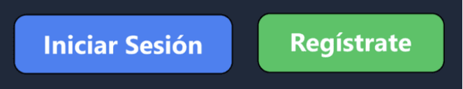

**Misc**

Barra de navegación:

La barra de navegación de **TuChambaMásCercana** mantiene la coherencia visual de la marca, utilizando un fondo en color #1F3C88, un tono profundo y profesional que aporta distinción en la parte superior de la página. Las secciones incluyen Inicio, Beneficios, Testimonios, Equipo, Video, Soporte y Ayuda,  Iniciar sesión y Regístrate permitiendo a los usuarios navegar fácilmente entre las diferentes funcionalidades de la plataforma.

**4.1.2. Web Style Guidelines:**

Para el diseño web de TuChambaMásCercana, adoptaremos una estética moderna y funcional que combine simplicidad visual con claridad informativa, priorizando siempre la experiencia del usuario. El enfoque será accesible, amigable y coherente con los valores de transparencia y comunidad que promueve la plataforma.

🎨 Paleta de Colores

La interfaz utilizará un fondo en tonos celeste claro (#ADD8E6) y blanco, lo cual transmite frescura, cercanía y limpieza visual. Para secciones clave como el encabezado y pie de página, emplearemos un azul oscuro (#1E293B) que aporta profesionalismo y contraste.

Los botones principales, como “Iniciar Sesión” y “Regístrate”, utilizarán tonos como el azul vibrante (#3B82F6) y el verde lima (#22C55E) para resaltar llamadas a la acción sin saturar la vista. Además, se emplearán colores suaves en fondos secundarios para organizar visualmente el contenido sin distraer al usuario.

🖋️ Tipografía

Se utilizará una sola fuente: Segoe UI, reconocida por su claridad y estética moderna. Se aplicarán distintos tamaños y pesos para establecer una jerarquía clara:

Títulos principales: 40px, negrita

Subtítulos: 32px, negrita

Textos informativos: 20px, regular

Esta selección asegura una lectura cómoda en todo tipo de dispositivos.

Diseño Responsive

La plataforma estará diseñada bajo los principios del Responsive Web Design, garantizando que se adapte fluidamente a distintos tamaños de pantalla, desde computadoras de escritorio hasta tablets y smartphones. Esto asegura una experiencia de navegación consistente, accesible y sin fricciones para todos los usuarios.

Elementos Interactivos y Animaciones

Se incorporarán animaciones suaves y transiciones sutiles al interactuar con botones, formularios y menús, con el objetivo de aportar dinamismo sin restar velocidad. Estos elementos harán que la interacción sea más natural y agradable.

Estructura Visual y Navegación

El sitio estará organizado por secciones claras y bien delimitadas. Se empleará una navegación superior fija que facilite el acceso rápido a cualquier parte del sitio, acompañada de menús desplegables intuitivos que ordenen la información por categorías relevantes.

Accesibilidad y Usabilidad

Todo el diseño cumple con estándares de accesibilidad web. Los colores tienen suficiente contraste para facilitar la lectura, y los elementos clave como botones, enlaces y formularios son fácilmente identificables y usables con teclado o lectores de pantalla.

**4.2. Information Architecture:**

En esta sección nos enfocaremos en el contenido visual, los estilos y elementos que tendrán en cuenta para nuestra Landing Page como también en nuestro aplicativo web de  TuChambaMasCerca. A continuación explicaremos los temas de sistema  de organización, sistemas de etiquetado, Etiquetas SEO y Metaetiquetas, Sistemas de búsqueda y Sistemas de Navegación. 

**4.2.1. Organization Systems:**

Para estructurar y presentar la información dentro de TuChambaMásCercana, se han considerado diversos sistemas de organización que optimizan la experiencia del usuario al navegar por la plataforma:

Organización por Encabezado (Header-Based Organization): Se ha optado por ubicar las secciones clave del sitio dentro de un encabezado visible y bien estructurado. Esta estrategia permite que los usuarios identifiquen de manera inmediata las opciones disponibles y puedan acceder a las diferentes funcionalidades con facilidad.

Jerarquía Visual (Visual Hierarchy): La información será organizada destacando visualmente los elementos más importantes, como las recomendaciones laborales, los rankings de empresas y los comentarios de otros usuarios. Este enfoque guía la atención del usuario hacia los datos más relevantes y facilita la toma de decisiones informadas.

Secuencia Paso a Paso (Sequential Organization): Se aplicará una lógica progresiva para que los usuarios completen tareas esenciales como registrarse, publicar una recomendación o buscar empresas. Esta secuenciación asegura un recorrido fluido e intuitivo a lo largo de la plataforma.

Organización Matricial (Matrix Organization): Se utilizará una estructura tipo matriz para presentar comparaciones entre múltiples elementos, como empresas, calificaciones o ubicaciones. Esto permitirá a los usuarios analizar y contrastar información clave en una misma vista, apoyando una toma de decisiones más informada y ágil.

**4.2.2. Labeling Systems:** 

Para garantizar una navegación clara y coherente dentro de la plataforma TuChambaMásCercana, se han definido estrategias de etiquetado que permitan identificar fácilmente el contenido y las funciones disponibles:

Etiquetas Claras y Descriptivas: Se han seleccionado nombres sencillos y directos para cada sección, tales como Inicio, Beneficios, Testimonios, Equipo o Mapa de Empresas. Estas etiquetas ayudan al usuario a entender rápidamente qué encontrará en cada apartado, sin necesidad de explorar a ciegas.

Consistencia en el Lenguaje: Todas las etiquetas siguen un estilo uniforme, tanto en redacción como en tono. Por ejemplo, se utiliza un lenguaje inclusivo, cercano y orientado al usuario, lo que contribuye a generar confianza y facilita la comprensión, especialmente para personas que acceden por primera vez.

Etiquetado Visual y Funcional: Los íconos que acompañan a cada etiqueta también están pensados para reforzar su significado. Por ejemplo, el símbolo de un mapa acompaña la sección Empresas Cercanas, mientras que un ícono de estrella señala la sección de Ranking de Empresas.

Etiquetado Contextual: Además de las etiquetas de navegación, la plataforma incluye etiquetas contextuales dentro del contenido, como filtros por “Tipo de Empresa”, “Modalidad de Trabajo”, “Ubicación” o “Nivel de Experiencia”. Estas etiquetas permiten refinar la búsqueda de información de forma rápida y precisa.

Estas estrategias aseguran que el usuario pueda ubicarse fácilmente dentro del sistema, minimizando la confusión y mejorando la experiencia general de uso.

**4.2.3. SEO Tags and Meta Tags:** 

Con el objetivo de asegurar una mayor visibilidad en motores de búsqueda y mejorar el posicionamiento orgánico de TuChambaMásCercana, se ha implementado una estrategia efectiva de SEO (Search Engine Optimization) basada en el uso adecuado de etiquetas SEO y metaetiquetas:

Título de Página (Page Title): Cada vista principal de la plataforma cuenta con un título único, claro y optimizado para buscadores, como “Encuentra tu empleo ideal con TuChambaMásCercana – Reseñas reales de empresas tech en Perú”. Esto mejora la relevancia en las búsquedas y atrae a usuarios con intenciones específicas.

Meta Descripción (Meta Description): Se ha definido una descripción concisa para cada sección del sitio, que resuma su valor de forma atractiva. Por ejemplo: “Explora recomendaciones laborales reales y geolocalizadas de empresas tecnológicas en Perú. Encuentra empleos confiables y evita ambientes tóxicos con ayuda de la comunidad.”

Etiquetas de Palabras Clave (Meta Keywords): Aunque algunos motores ya no las utilizan activamente, se incluyen keywords relevantes como empleos tecnológicos Perú, recomendaciones laborales, mapa de empresas, cultura organizacional, plataforma de reseñas laborales, prácticas profesionales tech, entre otras, para apoyar estrategias complementarias de posicionamiento.

Etiquetas Open Graph (OG Tags): Para una mejor presentación en redes sociales, se han configurado etiquetas como og:title, og:description y og:image, lo que asegura que al compartir la plataforma se muestre con un título atractivo, una descripción resumida y una imagen visual representativa.

Etiquetas Alt para Imágenes: Todas las imágenes incluyen atributos alt descriptivos que no solo apoyan la accesibilidad, sino que también contribuyen al SEO al ofrecer contexto adicional a los motores de búsqueda.

Estas buenas prácticas permiten que TuChambaMásCercana se indexe correctamente, mejore su alcance digital y refuerce su presencia entre usuarios que buscan transparencia y confianza en el ámbito laboral tecnológico.

**4.2.4. Searching Systems:** 

Para facilitar la localización de contenido específico dentro de la plataforma TuChambaMásCercana, se ha diseñado un sistema de búsqueda eficiente y adaptado a las necesidades de los usuarios:

- Barra de Búsqueda Global: Se incorpora una barra de búsqueda accesible desde cualquier sección del sitio, permitiendo a los usuarios buscar empresas, recomendaciones, filtros laborales, o términos clave sin necesidad de navegar manualmente por el contenido.
- Búsqueda con Autocompletado: La función de autocompletado sugiere resultados mientras el usuario escribe, acelerando el proceso de búsqueda y reduciendo errores tipográficos o de interpretación.
- Filtros Avanzados: Se ofrecen filtros específicos que permiten refinar los resultados por ubicación, tipo de empresa, modalidad de trabajo (remoto, híbrido, presencial), beneficios, nivel de experiencia, cultura laboral, entre otros. Esto permite una búsqueda personalizada y precisa.
- Búsqueda Contextual: En determinadas secciones, como el mapa de empresas o los rankings, el sistema ofrece opciones de búsqueda localizadas que ajustan los resultados a la vista activa del usuario.

Con estos mecanismos, se asegura una experiencia fluida que permite a los usuarios encontrar rápidamente la información que necesitan para tomar decisiones laborales informadas.

**4.2.5. Navigation Systems:** 

La plataforma TuChambaMásCercana ha sido diseñada con una estructura de navegación clara, intuitiva y adaptable a todo tipo de usuarios, garantizando una experiencia de uso accesible desde el primer ingreso:

Menú Principal Fijo: Se implementa un encabezado (header) fijo con las secciones clave del sitio: Inicio, Beneficios, Comunidad, Testimonios, Equipo, Video, Soporte, Iniciar sesión y Regístrate. Esto permite a los usuarios moverse fácilmente por el sitio sin perder de vista las opciones principales.

Navegación Jerárquica: Se organiza el contenido de forma descendente desde lo general a lo específico. Por ejemplo, desde la vista general del mapa laboral, los usuarios pueden profundizar en los perfiles de empresas y luego en las recomendaciones puntuales.

Navegación por Tarjetas y Secciones: El diseño emplea bloques visuales o tarjetas interactivas que permiten explorar información de forma segmentada, como empresas destacadas, rankings, últimas reseñas o alertas recientes.

Enlaces Contextuales y Botones de Acción: A lo largo del contenido, se integran botones de acción como “Ver más”, “Contactar”, “Calificar empresa” que invitan a continuar la navegación de manera intuitiva y guiada.

Responsive Design: Todo el sistema de navegación está adaptado para funcionar de forma óptima tanto en computadoras de escritorio como en dispositivos móviles, asegurando accesibilidad desde cualquier entorno.

Estos sistemas de navegación fortalecen la usabilidad general de la plataforma, facilitando el descubrimiento de funcionalidades y mejorando la retención de los usuarios.

**4.3. Landing Page UI Design.**

En esta sección se muestra la propuesta de interfaz de usuario (UI) para la Landing Page de TuChambaMasCercana.

**4.3.1 Landing Page Wireframe**

En TuChambaMásCercana, hemos diseñado una Landing Page pensada para guiar al usuario de forma clara y atractiva hacia el valor principal de nuestra plataforma: descubrir y compartir experiencias laborales reales en el sector tecnológico. A continuación, presentamos las secciones clave del wireframe y su funcionalidad:

🧭 Barra de Navegación

Ubicada en la parte superior de la página, esta barra permite un acceso rápido a las secciones más importantes. Incluye las siguientes opciones:

Inicio: Lleva al usuario a la sección principal con una presentación clara de la misión del proyecto y su propuesta de valor.

Beneficios: Describe cómo la plataforma ayuda a los usuarios a tomar mejores decisiones laborales mediante experiencias reales y filtradas.

Comunidad: Muestra testimonios breves de usuarios reales y promueve el sentido de colaboración entre profesionales.

Testimonios: Presenta experiencias en profundidad sobre cómo TuChambaMásCercana impactó positivamente en sus decisiones laborales.

Conócenos: Sección dedicada al equipo detrás del proyecto, destacando su compromiso con la transparencia laboral.

Videos: Muestra contenido audiovisual que resume el funcionamiento de la plataforma y su impacto en la comunidad tecnológica.

Soporte y Ayuda: Canal directo para resolver dudas o recibir orientación sobre el uso de la plataforma.

Iniciar sesión / Regístrate: Botones destacados que dirigen al usuario a las páginas de autenticación.

**Link del Figma: <https://www.figma.com/design/IS6Adu0QVoYFAYeRQ5i0jN/TuChambaMasCerca?node-id=0-1&t=0yHxjGogZs6efEXJ-1>** 

Esta sección presenta los wireframes del Landing Page de TuChambaMasCercana para Desktop Web Browser.

**Wireframe - Sección Hero**

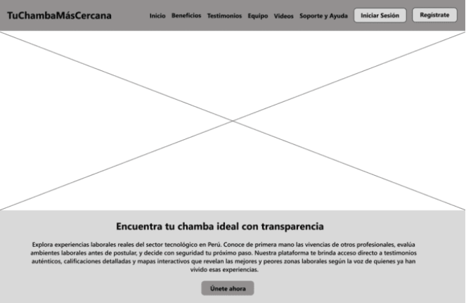

**Wireframe - Sección Beneficios**

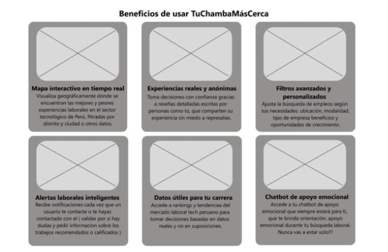

**Wireframe - Sección Comunidad**

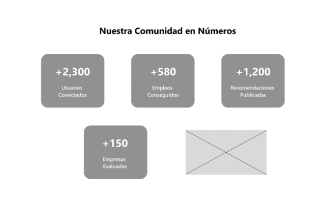

**Wireframe - Sección Testimonio**

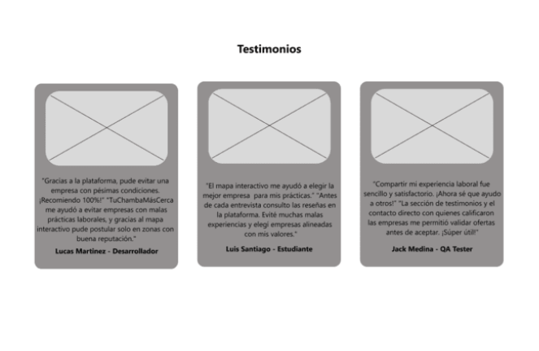

**Wireframe - Sección Conoce al Equipo**

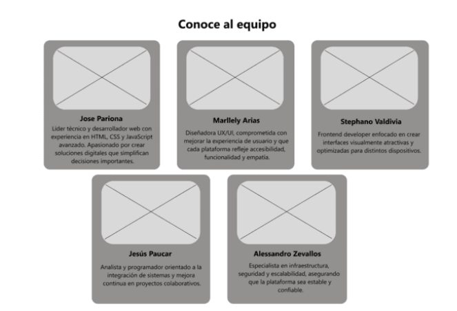

**Wireframe - Sección Videos + Acerca de Nosotros**

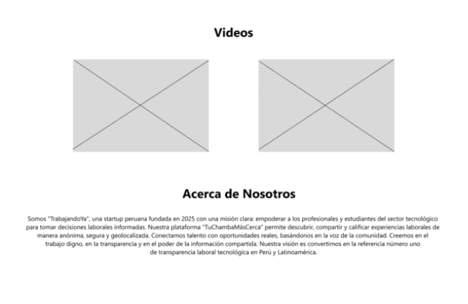

**Wireframe - Sección Soporte y Ayuda + Footer**

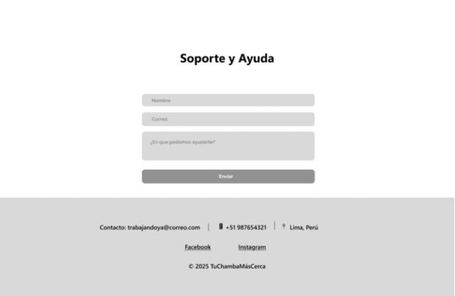

**4.3.2 Landing Page Mock-up**

Esta sección presenta los Mock-up del Landing Page de TuChambaMasCercana para Desktop Web Browser.

**Mock-up - Sección Hero**

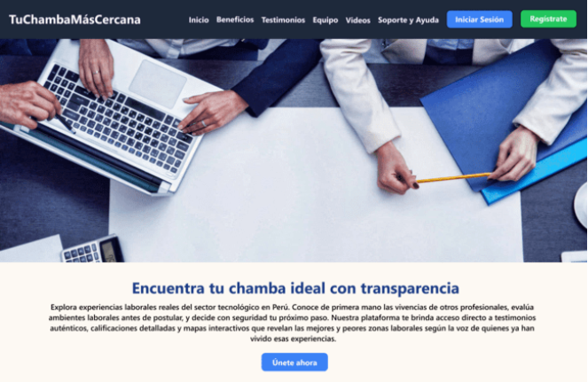

**Mock-up - Sección Beneficios**

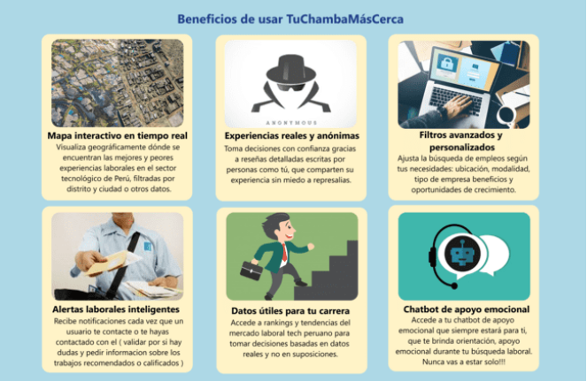

**Mock-up - Sección Comunidad**

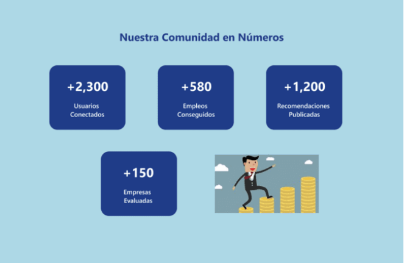

**Mock-up - Sección Testimonio**

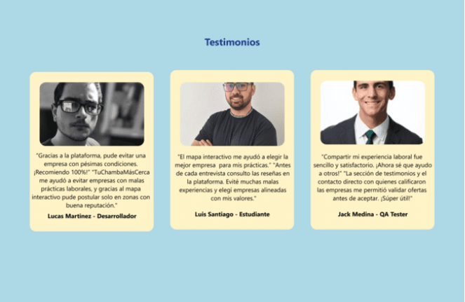

**Mock-up - Sección Conoce al Equipo**

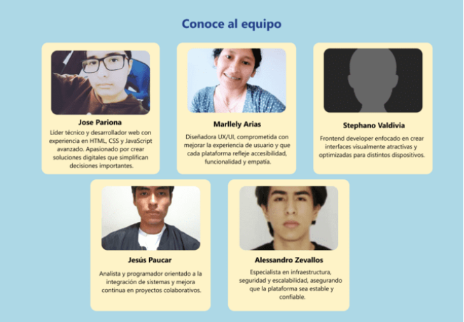

**Mock-up - Sección Videos + Acerca de Nosotros**

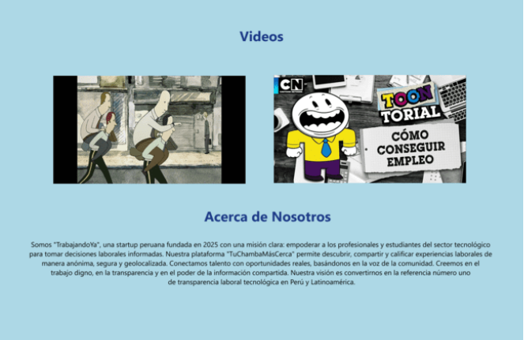

**Mock-up - Sección Soporte y Ayuda + Footer**

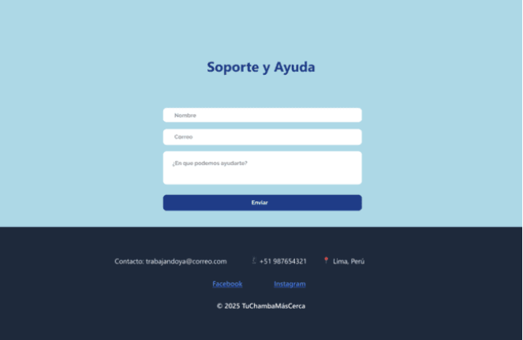

**4.4. Web Applications UX/UI Design** 

**4.4.1. Web Applications Wireframes.**

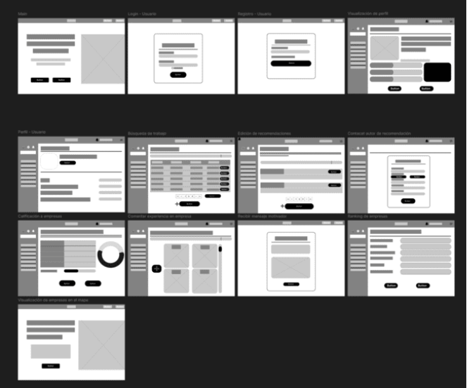

<https://www.figma.com/design/PBMT7m2WRVNmkRplKgbnZc/Open-Source-project?node-id=19-2&m=dev&t=Y3MN6QsAqHzml0f3-1>

**4.4.2. Web Applications Wireflow Diagrams.**

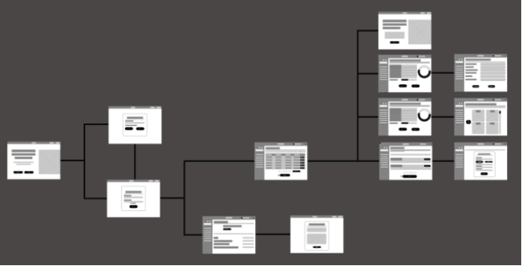

<https://www.figma.com/design/PBMT7m2WRVNmkRplKgbnZc/Open-Source-project?node-id=19-2&m=dev&t=Y3MN6QsAqHzml0f3-1>

**4.4.3. Web Applications Mock-ups.**

![ref1]

<https://www.figma.com/design/PBMT7m2WRVNmkRplKgbnZc/Open-Source-project?node-id=19-2&m=dev&t=Y3MN6QsAqHzml0f3-1>

**4.4.4. Web Applications User Flow Diagrams.**

![ref1]

Link: <https://www.figma.com/design/PBMT7m2WRVNmkRplKgbnZc/Open-Source-project?node-id=19-2&m=dev&t=Y3MN6QsAqHzml0f3-1>

**4.5. Web Applications Prototyping.**

Los criterios que guiaron las decisiones de interacción están centrados en ofrecer una experiencia fluida, intuitiva y coherente. Se priorizó la accesibilidad, la facilidad de uso y la estética funcional, siguiendo los principios del diseño centrado en el usuario. Las decisiones aquí evidencian la aplicación de la arquitectura de información previamente desarrollada, en especial en lo que respecta al sistema de navegación (Navigation Systems), la estructura jerárquica del contenido (Organization Systems) y los sistemas de búsqueda integrados (Searching Systems).

Link del prototipo: <https://www.figma.com/proto/PBMT7m2WRVNmkRplKgbnZc/Open-Source-project?node-id=2026-30&t=Y3MN6QsAqHzml0f3-1>

**4.6. Domain-Driven Software Architecture.**

Este enfoque de diseño de software se centra en analizar y entender detalladamente el contexto específico en el que se utilizará la aplicación. Busca crear software que responda exactamente a los requerimientos y objetivos comerciales del entorno en el que se implementa.

**4.6.1. Software Architecture Context Diagram.**

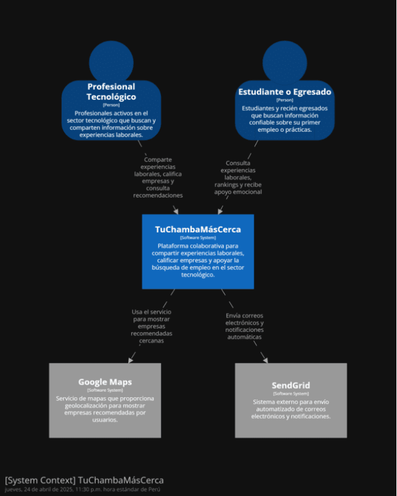

**4.6.2. Software Architecture Container Diagrams.**

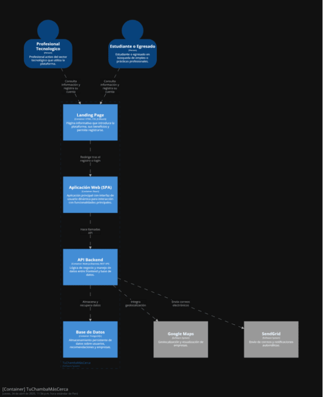

**4.6.3. Software Architecture Components Diagrams**

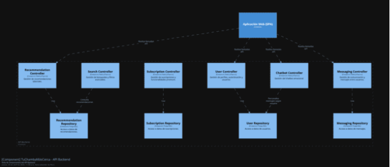

**4.7.  Software Object-Oriented Design**

En esta sección se verá la estructuración de nuestra start-up que será a lo largo de nuestro proyecto: 

**4.7.1. Class Diagrams**

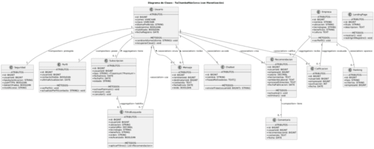

**4.7.2. Class Dictionary**
### **Dominio: Usuario**
#### **Clase: Usuario**

|**Atributo**|**Tipo**|**Descripción**|
| :-: | :-: | :-: |
|**id**|**BIGINT (PK, IDENTITY)**|**Identificador único del usuario**|
|**correo**|**VARCHAR**|**Correo electrónico único del usuario**|
|**clave**|**VARCHAR**|**Contraseña encriptada**|
|**idiomaPreferido**|**STRING**|**Idioma de preferencia del usuario**|
|**esAnonimo**|**BOOLEAN, DEFAULT TRUE**|**Determina si el perfil es anónimo**|
|**habilitado**|**BOOLEAN, DEFAULT TRUE**|**Estado activo del usuario**|
|**fechaRegistro**|**DATE**|**Fecha de creación de cuenta**|

**Métodos:**

- **cambiarIdioma(idioma: STRING): void**

- **recuperarClave(): void**

-----
#### **Clase: Perfil**

|**Atributo**|**Tipo**|**Descripción**|
| :-: | :-: | :-: |
|**id**|**BIGINT (PK)**|**ID del perfil**|
|**usuarioId**|**BIGINT (FK)**|**Relación uno a uno con Usuario**|
|**contactoVisible**|**BOOLEAN**|**Controla si el usuario quiere mostrar contacto**|
|**ultimaActualizacion**|**DATE**|**Fecha de última modificación del perfil**|

**Métodos:**

- **verPerfil(): void**

- **actualizarPerfil(contacto: STRING): void**

-----
#### **Clase: Subscripcion**

|**Atributo**|**Tipo**|**Descripción**|
| :-: | :-: | :-: |
|**id**|**BIGINT (PK)**|**ID de suscripción**|
|**usuarioId**|**BIGINT (FK)**|**Usuario que tiene la suscripción**|
|**tipo**|**STRING**|**"Freemium" o "Premium"**|
|**fechaInicio**|**DATE**|**Inicio del plan**|
|**fechaFin**|**DATE**|**Fin del plan**|
|**estado**|**STRING**|**Estado: activo, expirado, cancelado**|

**Métodos:**

- **activarPremium(): void**

- **renovar(): void**

- **cancelar(): void**

-----
### **Dominio: Empresa y Recomendaciones**
#### **Clase: Empresa**

|**Atributo**|**Tipo**|**Descripción**|
| :-: | :-: | :-: |
|**id**|**BIGINT (PK)**|**ID de la empresa**|
|**nombre**|**STRING**|**Nombre de la empresa**|
|**ubicacion**|**STRING**|**Dirección / distrito**|
|**tecnologias**|**STRING**|**Herramientas utilizadas**|
|**beneficios**|**STRING**|**Beneficios destacados**|
|**cultura**|**TEXT**|**Descripción del clima laboral**|

**Método:**

- **verPerfil(): void**

-----
#### **Clase: Recomendacion**

|**Atributo**|**Tipo**|**Descripción**|
| :-: | :-: | :-: |
|**id**|**BIGINT (PK)**|**ID de la recomendación**|
|**usuarioId**|**BIGINT (FK)**|**Usuario que publica**|
|**empresaId**|**BIGINT (FK)**|**Empresa evaluada**|
|**salario**|**DECIMAL**|**Sueldo reportado**|
|**herramientas**|**TEXT**|**Herramientas usadas**|
|**ambienteLaboral**|**TEXT**|**Condiciones de trabajo**|
|**procesoEntrevista**|**TEXT**|**Detalles del proceso**|
|**fechaPublicacion**|**DATE**|**Fecha de publicación**|

**Métodos:**

- **actualizar(): void**

- **eliminar(): void**

-----
#### **Clase: Comentario**

|**Atributo**|**Tipo**|**Descripción**|
| :-: | :-: | :-: |
|**id**|**BIGINT (PK)**|**ID del comentario**|
|**usuarioId**|**BIGINT (FK)**|**Usuario que comenta**|
|**recomendacionId**|**BIGINT (FK)**|**Recomendación comentada**|
|**contenido**|**TEXT**|**Contenido textual**|
|**fecha**|**DATE**|**Fecha del comentario**|

-----
#### **Clase: Calificacion**

|**Atributo**|**Tipo**|**Descripción**|
| :-: | :-: | :-: |
|**id**|**BIGINT (PK)**|**ID de calificación**|
|**usuarioId**|**BIGINT (FK)**|**Usuario que califica**|
|**empresaId**|**BIGINT (FK)**|**Empresa calificada**|
|**puntuacion**|**INT**|**De 1 a 5 estrellas**|
|**fecha**|**DATE**|**Fecha de evaluación**|

-----
### **Dominio: Comunicación**
#### **Clase: Mensaje**

|**Atributo**|**Tipo**|**Descripción**|
| :-: | :-: | :-: |
|**id**|**BIGINT (PK)**|**ID del mensaje**|
|**remitenteId**|**BIGINT (FK)**|**Usuario que envía**|
|**destinatarioId**|**BIGINT (FK)**|**Usuario que recibe**|
|**contenido**|**TEXT**|**Texto del mensaje**|
|**fechaEnvio**|**DATE**|**Fecha y hora**|
|**leido**|**BOOLEAN**|**Estado de lectura**|

-----
### **Dominio: Emocional**
#### **Clase: Chatbot**

|**Atributo**|**Tipo**|**Descripción**|
| :-: | :-: | :-: |
|**id**|**BIGINT (PK)**|**ID del bot**|
|**nombre**|**STRING**|**Nombre del bot**|
|**frasesMotivadoras**|**TEXT[]**|**Lista de frases automáticas**|

**Método:**

- **enviarFrase(usuarioId: BIGINT): STRING**

-----
###  **Dominio: Seguridad**
#### **Clase: Seguridad**

|**Atributo**|**Tipo**|**Descripción**|
| :-: | :-: | :-: |
|**id**|**BIGINT (PK)**|**ID del control**|
|**usuarioId**|**BIGINT (FK)**|**Usuario asegurado**|
|**tipoAutenticacion**|**STRING**|**Ej: "email", "2FA"**|
|**usoHTTPS**|**BOOLEAN**|**Canal seguro**|
|**datosCifrados**|**BOOLEAN**|**Encriptación**|
|**nivelAcceso**|**STRING**|**Ej: "básico", "admin"**|

-----
### **Dominio: Búsqueda y Ranking**
#### **Clase: FiltroBusqueda**

|**Atributo**|**Tipo**|**Descripción**|
| :-: | :-: | :-: |
|**id**|**BIGINT (PK)**|**ID del filtro**|
|**usuarioId**|**BIGINT (FK)**|**Usuario que usa filtro**|
|**ubicacion**|**STRING**|**Ubicación geográfica**|
|**salarioMin**|**DECIMAL**|**Filtro mínimo de sueldo**|
|**tecnologia**|**STRING**|**Tecnología preferida**|
|**beneficio**|**STRING**|**Beneficio buscado**|
|**orden**|**STRING**|**Criterio de orden**|
|**esAvanzado**|**BOOLEAN**|**Requiere Premium**|

**Método:**

- **aplicarFiltros(): List<Recomendacion>**

-----
#### **Clase: Ranking**

|**Atributo**|**Tipo**|**Descripción**|
| :-: | :-: | :-: |
|**id**|**BIGINT (PK)**|**ID del ranking**|
|**tipo**|**STRING**|**"Mejor" o "Peor"**|
|**criterios**|**STRING**|**Criterios usados**|
|**empresaId**|**BIGINT (FK)**|**Empresa listada**|

-----
### **Dominio: Landing Page**
#### **Clase: LandingPage**

|**Atributo**|**Tipo**|**Descripción**|
| :-: | :-: | :-: |
|**id**|**BIGINT (PK)**|**ID de la página**|
|**titulo**|**STRING**|**Encabezado**|
|**descripcion**|**TEXT**|**Qué ofrece la plataforma**|

**Métodos:**

- **mostrar(): void**

- **redirigirARegistro(): void**

**4.8. Database Design**

Veremos el diagrama de nuestra base de datos, posterior a esto habrá correcciones dependiendo a observaciones en nuestro proyecto.

**4.8.1 Database Diagram**

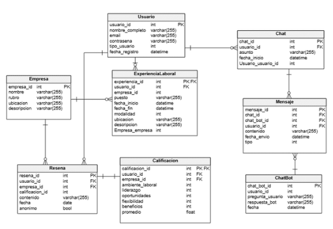

**Capítulo V: Product Implementation, Validation & Deployment.**

**5.1. Software Configuration Management.**
### **5.1.1 Software Development Environment Configuration**
Gestión del Proyecto

- GitHub (<https://github.com>)
  Se creó una organización con cuatro repositorios: Informe, Landing Page, Frontend y Backend. En GitHub se centraliza la gestión del código fuente, issues y colaboración entre los miembros del equipo.

Gestión de Requisitos

- Pivotal Tracker (<https://www.pivotaltracker.com>)
  Se utiliza para la gestión de historias de usuario y tareas. Aquí se organiza el *product backlog* y se hace seguimiento del avance del proyecto.

Diseño UX/UI del Producto

- UXPressia (<https://uxpressia.com>)
  Herramienta para desarrollar los perfiles de usuario (*User Persona*), mapas de empatía y *User Journey Mapping*.
- Figma (<https://www.figma.com/es-es>)
  Usado para la creación de *wireframes*, *mockups* y prototipos de la Landing Page y futura aplicación web.

Desarrollo de Software

- Git: Sistema de control de versiones distribuido.
- HTML5 y CSS3: Lenguajes usados para la estructura y estilo de la Landing Page.
- JavaScript: Lenguaje de programación que añade dinamismo e interactividad.
- VSCode: Editor de código fuente utilizado para el desarrollo.
- Angular: Framework para el desarrollo del frontend de la aplicación web.

Despliegue de Software

- GitHub Pages: Plataforma usada para desplegar la Landing Page directamente desde su repositorio.
  -----
  ### **5.1.2 Source Code Management** 
El código fuente es gestionado mediante Git y hospedado en GitHub. La organización del equipo contiene cuatro ramas:

- Informe
- Landing Page
- Frontend
- Backend

  que estarán dentro de cada uno de estos 3 repositorios: 

- Organizacion del  Proyecto TP1: https://github.com/parionalucasjosemanuel/upc-pre-2510-daos-4346-grupo5-tp1
- Organziacion del Proyecto TF1: https://github.com/parionalucasjosemanuel/upc-pre-2510-daos-4346-grupo5-tf1
- Organizacion del Proyecto: DD1:  https://github.com/parionalucasjosemanuel/upc-pre-2510-daos-4346-grupo5-dd1

Se sigue el flujo de trabajo Gitflow con las siguientes ramas principales:

- main: Contiene las versiones estables de entrega.
- develop: Rama de integración donde se agregan nuevas funcionalidades.
- feature/\*: Ramas temporales usadas para desarrollar funcionalidades específicas o capítulos del informe. Se nombran como feature/chapter#.

Versionado Semántico 2.0.0 (<https://semver.org/>)

- MAJOR: Cambios incompatibles en la API.
- MINOR: Nuevas funcionalidades compatibles.
- PATCH: Correcciones de errores menores.

Commits Convencionales (<https://www.conventionalcommits.org/>)

Formato: <type>[optional scope]: <description>
Ejemplos de tipo: feat, fix, docs, refactor, test, build, etc.

-----
### **5.1.3 Source Code Style Guide & Conventions**
HTML

- Uso de minúsculas en nombres de elementos y atributos.
- Comillas obligatorias para los valores.
- Atributos alt, width, height en imágenes.
- Indentación de cuatro espacios.
- Sintaxis de HTML5.
- Evitar id innecesarios; preferir class y data-\*.

CSS

- Nombres de clases significativos.
- Palabras separadas por guiones.
- Usar notación hexadecimal corta cuando sea posible.
- Evitar !important; priorizar la especificidad.
- Uso de punto y coma final y espacio tras el :.
- Preferencia por comillas simples.

JavaScript (Angular)

- camelCase para variables, funciones y propiedades.
- PascalCase para clases.
- Constantes en UPPERCASE.
- Uso de === y !==.
- Punto y coma obligatorio.

Java (Spring Boot)

- camelCase para variables y métodos.
- PascalCase para clases.
- Preferir tipos primitivos.
- Uso de anotaciones como @Autowired, @GetMapping, etc.
- Uso de Lombok para reducir boilerplate.
  -----
  ### **5.1.4 Software Deployment Configuration**
La Landing Page del proyecto se despliega mediante GitHub Pages. El procedimiento seguido es:

1. Crear el repositorio landing-page.
1. Subir los archivos del proyecto con su respectivo commit.
1. Configurar la opción de GitHub Pages en el repositorio.
1. Copiar y usar la URL proporcionada por GitHub para visualizar la landing.

**5.2. Landing Page, Services & Applications Implementation.**

**5.2.1. Sprint 1**

**5.2.1.1. Sprint Planning 1.**

|Sprint #|Sprint 1|
| :- | :- |
|Sprint Planning Background ||
|Date |2025/24/4|
|Time|03:00 PM|
|Location|Modalidad virtual por Discord |
|Prepared By|Integrantes de TrabajandoYa|
|Attendess (to planning meeting) |
-Marllely Anahi Arias Segil,

-Jose Manuel Pariona Lucas,

-Jesús Fernando Paucar Zenteno,

-Stephano Renan Valdivia Quispe,

-Alessandro Netto Zevallos Linares

|
|Sprint n-1 Review Summary |
Se definieron las historias de usuario para  la landing  page y para la aplicación web de TuChambaMásCerca 

La Landing Page se implementó exitosamente.
|
|
Sprint n-1 Retrospective

Sumary 
|Hubo una buena  comunicación entre los integrantes y cada uno de ellos aportó con ideas para el proyecto (Landing Page- Aplicacion Web) |
|Sprint Goal & User Stories ||
|Sprint 1 Goal |En este  sprint se tiene como objetivo el desarrollo de  la Landing Page y su despliegue. Permitirá a los usuarios tener más seguridad al entrar  en  la  aplicación web  TuChambaMásCerca. Esto será confirmado cuando los usuarios ingresen a  la  aplicación web desde los call to action de  la Landing Page. |
|Sprint 1 Velocity |2|
|Sum of Story Points |2|

**5.2.1.2. Aspect Leaders and Collaborators.**

|**Team Member (Last  Name, First Name)** |**Github Username** |**Aspect Name 1 Leader (L) / Collaborator (C)**|
| :- | :- | :- |
|Jose Manuel Pariona Lucas|**micchonofficial** |**L**|
|Marllely Anahi Arias Segil|**kuwuk0**|**C**|
|Jesús Fernando Paucar Zenteno|**devFernando22**|**C**|
|Stephano Renan Valdivia Quispe|**steph\_ano**|**C**|
|Alessandro Netto Zevallos Linares|

**OutBreakAZL**
|**C**|

**5.2.1.3. Sprint Backlog 1.**

|**Sprint #**|**Sprint 1**|||||||
| :- | :- | :- | :- | :- | :- | :- | :- |
|**User Story**||**Work-Item / Task** ||||||
|**id**|**Title**|**id** |**Title**|**Description**|**Estimation (Hours)**|**Assigned To**|**Status (To-do / In- Process / To-Review / Done)** |
|**US-22**|**Navegación informativa en la Landing Page**|**W22**|**Informative navigation on the Landing Page**|**Como visitante, deseo recorrer la landing page para conocer la plataforma.**|**2**|
-Marllely Anahi Arias Segil,

-Jose Manuel Pariona Lucas,

-Jesús Fernando Paucar Zenteno,

-Stephano Renan Valdivia Quispe,

-Alessandro Netto Zevallos Linares
|**Done**|
|**US-23**|**Redirección a formulario de registro**|**W23**|**Redirect to registration form**|**Como visitante, deseo ser redirigido desde la landing page al formulario de registro.**|**2**|
-Marllely Anahi Arias Segil,

-Jose Manuel Pariona Lucas,

-Jesús Fernando Paucar Zenteno,

-Stephano Renan Valdivia Quispe,

-Alessandro Netto Zevallos Linares
|**Done**|

**5.2.1.4. Development Evidence for Sprint Review.**

|**Repository**|**Branch**|**Commit Id**|**Commit Message** |**Commit Message Body**|**Commited on (Date)** |
| :- | :- | :- | :- | :- | :- |
|**upc-pre-2510-daos-4346-grupo5-tp1**|**LandingPage**|
**41a046c**

|**feature:**|**feat: add login.html**|**22/04/2025**|
|**upc-pre-2510-daos-4346-grupo5-tp1**|**LandingPage**|**558bf60**|**feature:** |**feat: add script.js** |**22/04/2025**|
|**upc-pre-2510-daos-4346-grupo5-tp1**|**LandingPage**|
**ac81dce**

|**feature:** |**feat: add style.css**|**22/04/2025**|
|**upc-pre-2510-daos-4346-grupo5-tp1**|**LandingPage**|

**80741b3**

|**feature:** |**feat: Update index.html**|**22/04/2025**|
|**upc-pre-2510-daos-4346-grupo5-tp1**|**LandingPage**|

**98e5e84**

|**feature:** |**feat: Add files via upload**|**22/04/2025**|

**5.2.1.5. Execution Evidence for Sprint Review.**

Por este primer sprint, se muestran las capturas de la landing page y video que ilustra y explica la visualización y navegación logrados en este Sprint. 

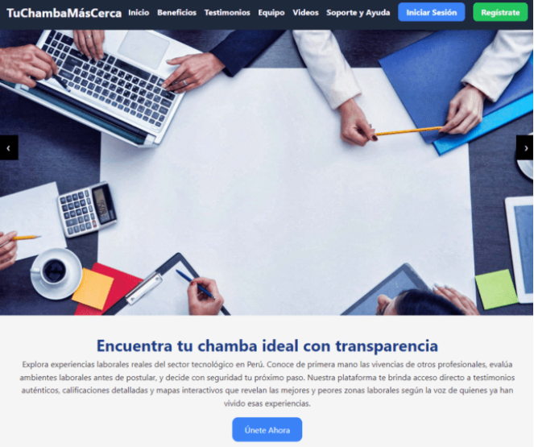

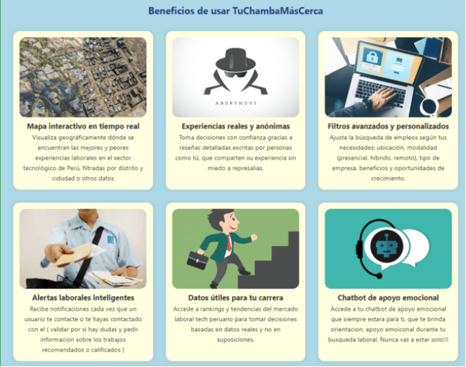

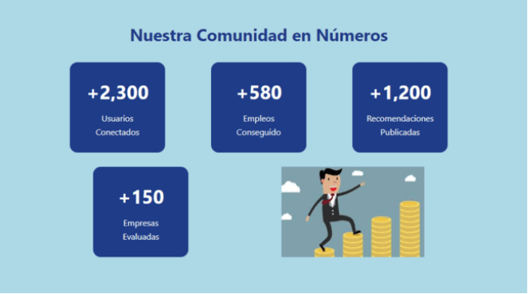

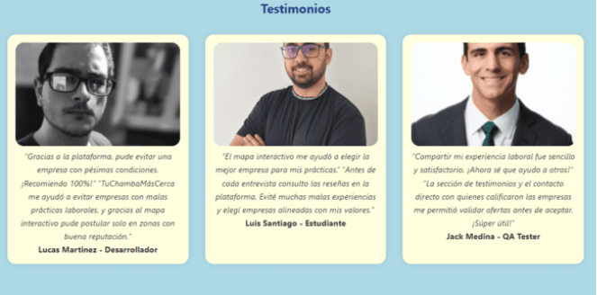

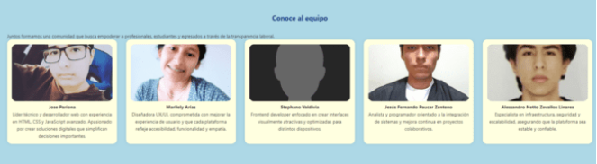

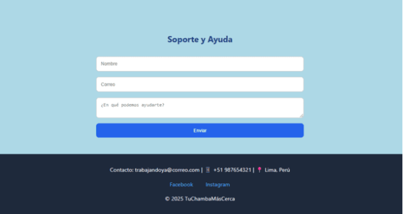

**Link de Video de la Landing Page: <https://youtu.be/53ijzxZvLJY>** 

**5.2.1.6. Services Documentation Evidence for Sprint Review.**

**Link de la Landing Page desplegada:   [https://tuchambamascercainicio.netlify.app](https://tuchambamascercainicio.netlify.app/)** 

**5.2.1.7. Software Deployment Evidence for Sprint Review.**

Para el desarrollo de la landing page, se usó lo siguiente:

HTML: Para la estructura de la landing page

CSS: Para darle estilos a la landing page

JS: Para darle dinamismo a la landing page

Git: Es el sistema de control de versiones

Github: Software online para almacenar repositorios Git

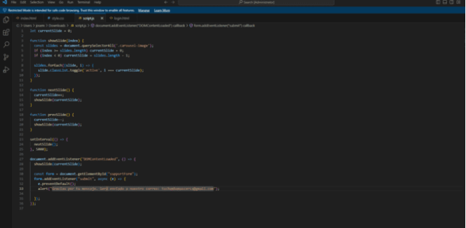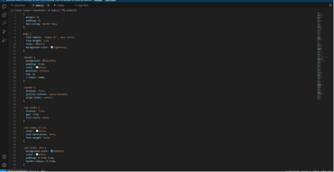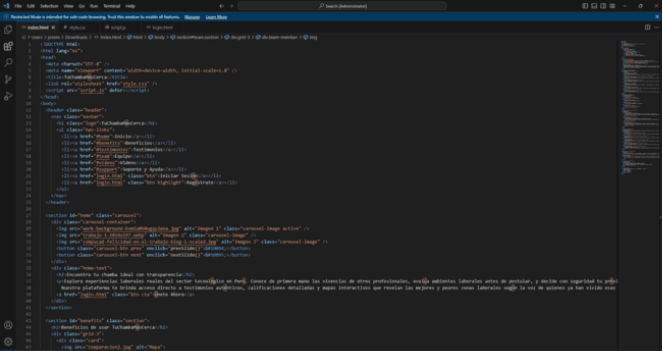

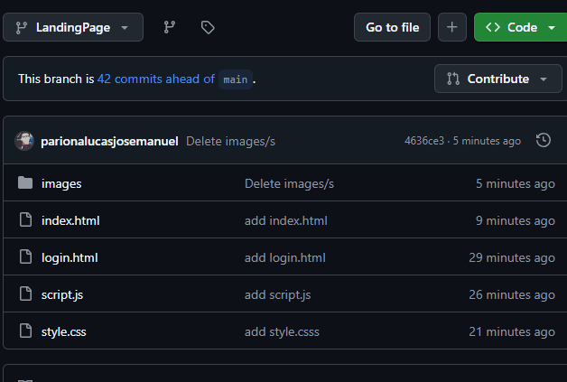

Para el despliegue de la landing page, se uso  lo siguiente: 

Netlify: Será utilizado para desplegar la landing page desarrollada, de manera que pueda accederse desde cualquier navegador mediante un enlace web.

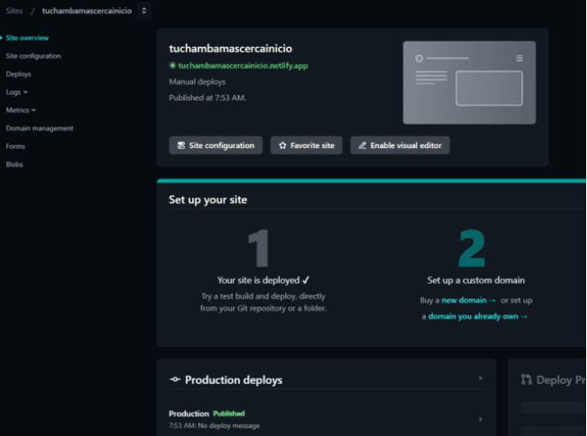

**5.2.1.8. Team Collaboration Insights during Sprint.**

Aquí se encuentra la captura de las contribuciones de la landing page:

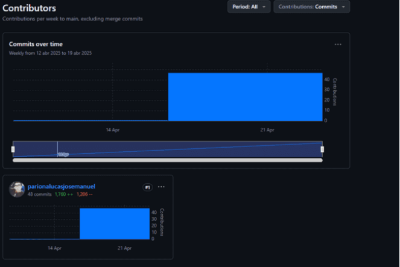

**Avance de Conclusiones, Bibliografía y Anexos.**

**Conclusiones y recomendaciones :**

1) **Empoderamiento del usuario como agente de cambio en la transparencia laboral**

El proyecto TuChambaMásCerca demuestra que una plataforma colaborativa puede empoderar a los profesionales del sector tecnológico, dándoles voz sobre sus experiencias laborales y transformándolos en agentes de cambio dentro del ecosistema laboral peruano. A través de funcionalidades como el mapa interactivo, la calificación anónima de empresas y el ranking colaborativo, se facilita la toma de decisiones informadas que podrían prevenir ambientes laborales tóxicos y fomentar buenas prácticas organizacionales. Este enfoque no solo responde a una necesidad actual no satisfecha por plataformas existentes como LinkedIn o GetOnBoard, sino que además propone un modelo más inclusivo, justo y centrado en la comunidad.

1) **Valor diferencial y sostenibilidad del modelo freemium**

El diseño de un modelo freemium accesible e inclusivo —con versiones gratuitas y premium— permite democratizar el acceso a información clave sin comprometer la sostenibilidad económica del proyecto. Este enfoque estratégico facilita la escalabilidad del producto al permitir monetización progresiva sin cerrar el acceso a los usuarios que más necesitan orientación. Además, las licencias institucionales para universidades fortalecen la vinculación academia-industria y promueven la empleabilidad desde el ámbito educativo.

1) **Innovación en experiencia de usuario basada en el contexto local**

El valor diferencial de TuChambaMásCerca radica en su enfoque local y segmentado, lo cual permite visibilizar patrones geográficos sobre condiciones laborales en Perú. A diferencia de plataformas globales, esta solución ha sido diseñada en base a entrevistas y técnicas de investigación contextual que revelan las preocupaciones reales de estudiantes y profesionales peruanos. El uso de elementos como el chatbot de apoyo emocional, filtros por modalidad de trabajo o métricas de clima organizacional refleja una comprensión profunda de las necesidades del usuario local, generando una experiencia altamente empática y funcional.

1) **Madurez metodológica del desarrollo del proyecto**

El desarrollo de TuChambaMásCerca evidencia una aplicación coherente y articulada de metodologías ágiles, diseño centrado en el usuario (Lean UX), modelado de requisitos (User Stories, Impact Mapping, Backlog), así como principios de diseño accesible e inclusivo. El uso de herramientas como Figma, Pivotal Tracker, GitHub y UXPressia permitió una ejecución profesional de cada fase del proyecto, desde el levantamiento de necesidades hasta la validación del prototipo. Este enfoque integral sienta las bases para una implementación técnica robusta, con miras a una futura expansión del producto.

1) **Cumplimiento integral de los entregables establecidos en la TB1**

El desarrollo del proyecto *TuChambaMásCerca* evidencia un cumplimiento riguroso y completo de todos los componentes exigidos por la estructura del Trabajo Final TB1 del curso *Desarrollo de Aplicaciones Open Source*. Desde la caracterización de la startup y la definición de la problemática, pasando por el levantamiento y especificación de requisitos, el diseño de producto, la arquitectura del software, hasta la configuración del entorno de desarrollo y la planificación de sprints, cada sección fue desarrollada en coherencia con los objetivos del curso. Asimismo, se lograron implementar las funcionalidades fundamentales establecidas en el backlog, y se dejaron sentadas las bases para los despliegues posteriores. Esto demuestra no solo la solidez técnica del equipo, sino también su capacidad para gestionar un proyecto real de desarrollo ágil de software, orientado al usuario y con valor social.

**Recomendaciones:** 

1. **Ejecutar una gestión ágil disciplinada basada en sprints temáticos enfocados**

Para asegurar el desarrollo ordenado y completo de todas las funcionalidades planteadas en el documento, es imprescindible estructurar los sprints del proyecto en función de bloques temáticos definidos por el backlog (registro de usuarios, recomendaciones, ranking, chatbot, etc.). Cada sprint debe contar con una planificación detallada, asignación clara de tareas y revisión colaborativa que permita detectar desviaciones y ajustar el ritmo de avance sin comprometer los entregables. Esta disciplina permitirá no solo cumplir con los objetivos funcionales propuestos, sino también mantener una cultura de mejora continua que se alinee con los principios de Lean UX y Scrum.

2. **Fortalecer la calidad del producto mediante validaciones continuas y pruebas con usuarios reales**

Tal como se propone en la fase de validación, es clave que cada funcionalidad desarrollada pase por ciclos de retroalimentación temprana y evaluación heurística. Esto no solo incluye pruebas técnicas (unitarias e integradas), sino también sesiones periódicas de usabilidad con perfiles similares a los segmentos objetivo (profesionales tech y estudiantes en búsqueda de prácticas). Las entrevistas, mapas de empatía y user journey previamente elaborados deben servir como base para diseñar pruebas de validación alineadas con las necesidades reales. Así se garantizará que el producto cumpla su promesa de utilidad, accesibilidad y confiabilidad desde el primer contacto del usuario.

3. **Desplegar progresivamente el sistema con documentación, control de versiones y ambientes diferenciados**

Para lograr un despliegue estable, ordenado y funcional de *TuChambaMásCerca*, se recomienda implementar una estrategia progresiva de desarrollo basada en lo establecido en los sprints planificados del informe, específicamente desde 5.2.1 hasta 5.2.4. Cada uno de estos sprints debe incluir su Sprint Planning, asignación de roles (Aspect Leaders y Collaborators), Sprint Backlog, evidencias de desarrollo, ejecución y documentación de servicios, así como análisis de colaboración en equipo. Además, estos entregables deben implementarse en ambientes diferenciados (desarrollo, pruebas y producción) para evitar interrupciones a usuarios finales. GitHub y GitFlow, ya definidos como herramientas centrales, deben utilizarse rigurosamente para versionar y documentar el progreso. Así, no solo se garantizará la calidad técnica del producto, sino también la trazabilidad y coordinación entre los miembros del equipo a lo largo del proceso de implementación.

4. **Cumplir estrictamente los principios de accesibilidad, seguridad y privacidad definidos en el alcance**

Una de las fortalezas del proyecto es su compromiso con la inclusión, la protección de datos y la navegación segura. Para lograr estos objetivos, es indispensable implementar desde el inicio estándares de seguridad como HTTPS, cifrado de contraseñas (bcrypt) y control de accesos. Asimismo, el desarrollo frontend debe aplicar principios de accesibilidad, asegurando compatibilidad con lectores de pantalla, navegación por teclado y una experiencia adaptada a distintos perfiles de usuario. El sistema de cambio de idioma (HU18) y las medidas de protección de datos personales (HU20 y HU21) no deben considerarse tareas secundarias, sino componentes estructurales que reflejan la ética del producto y su propuesta de valor.

**Bibliografia:**

1\. Pivotal Tracker. (s.f.). *Agile project management tool*. Recuperado el 24 de abril de 2025, de<https://www.pivotaltracker.com/>

2\. GitHub. (s.f.). *Where the world builds software*. Recuperado el 24 de abril de 2025, de<https://github.com/>

3\. UXPressia. (s.f.). *User journey mapping and persona builder tools*. Recuperado el 24 de abril de 2025, de<https://uxpressia.com/>

4\. Figma. (s.f.). *The collaborative interface design tool*. Recuperado el 24 de abril de 2025, de<https://www.figma.com/es-es/>

5\. Ministerio de Trabajo y Promoción del Empleo del Perú. (2023). *Informe de empleabilidad y rotación laboral en el sector tecnológico peruano*. Recuperado el 24 de abril de 2025, de<https://www.gob.pe/mtpe>

6\. Semantic Versioning. (s.f.). *Semantic Versioning 2.0.0*. Recuperado el 24 de abril de 2025, de<https://semver.org/>

7\. Ministerio de Trabajo y Promoción del Empleo del Perú. (2022). *Política Nacional de Empleo*. Recuperado el 24 de abril de 2025, de <https://www.gob.pe/mtpe/politicas-nacionales-empleo>

8\. Observatorio de Empleo y Dinámica Empresarial del Ministerio de Trabajo y Promoción del Empleo del Perú. (2024). *Análisis de tendencias del empleo en el sector tecnológico en el Perú*. Recuperado el 24 de abril de 2025, de <https://www.gob.pe/mtpe/observatorio-empleo>

9\. Gobierno de Perú. (2023). *Estrategia Nacional de Digitalización y Transformación Digital 2023-2025*. Recuperado el 24 de abril de 2025, de <https://www.gob.pe/estrategia-digitalizacion-peru>

10\. Ministerio de Economía y Finanzas del Perú. (2023). *Informe sobre la competitividad y el desarrollo tecnológico en el Perú*. Recuperado el 24 de abril de 2025, de <https://www.mef.gob.pe>

**Anexos:** 

**Video de Exposicion (TB1):** 

**Video About The Team:** 

[ref1]: Aspose.Words.c6e287c5-2f09-4cf1-acce-a4f0252ffcb7.049.png
